## 获取全名 <!-- {docsify-ignore-all} -->

   

### 处理过程

```plantuml
@startuml
hide empty description
<style>
root {
  HyperlinkColor #42b983
}
</style>

hide empty description
state "开始" as Begin <<start>> [[$./get_complete_name#begin {"开始"}]]
state "准备参数" as PREPAREPARAM_01  [[$./get_complete_name#prepareparam_01 {"准备参数"}]]


Begin --> PREPAREPARAM_01


@enduml
```

### 处理步骤说明

#### 开始 :id=Begin [开始]

*- N/A*
#### 准备参数 :id=PREPAREPARAM_01 [准备参数]

1. 将`Default(传入变量).NAME(名称)` 设置给  `compute_partner(计算后的联系人).NAME(名称)`

### 实体逻辑参数

|    中文名   |    代码名    |  数据类型    |  实体   |备注 |
| --------| --------| -------- | -------- | --------   |
|传入变量(<i class="fa fa-check"/></i>)|Default|数据对象|[联系人(RES_PARTNER)](module/base/res_partner.md)||
|计算后的联系人|compute_partner|会话变量|||
