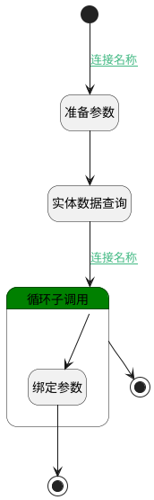

## 当前登录人的user <!-- {docsify-ignore-all} -->

   根据srfpartnerid获取user信息

### 处理过程

### 处理步骤说明

#### 开始 :id=Begin [开始]

*- N/A*
#### 准备参数 :id=PREPAREPARAM_01 [准备参数]

1. 将`Default(传入变量).srfpartnerid` 设置给  `filter_user.n_partner_id_eq`

#### 实体数据查询 :id=DEDATAQUERY_01 [实体数据查询]

调用实体 [用户(RES_USERS)](module/base/res_users.md) 数据查询 [DEFAULT](module/base/res_users#数据查询) ，查询参数为`filter_user`

将执行结果返回给参数`user_page`

#### 循环子调用 :id=LOOPSUBCALL_01 [循环子调用]

循环参数`user_page`，子循环参数使用`user`
#### 绑定参数 :id=BINDPARAM_01 [绑定参数]

绑定参数`user` 到 `Default(传入变量)`
#### 结束 :id=END_02 [结束]

返回 `Default(传入变量)`

#### 结束 :id=END_01 [结束]

返回 `跳出循环（BREAK）`

### 连接条件说明
#### 连接名称 :id=Begin-PREPAREPARAM_01

`Default(传入变量).srfpartnerid` ISNOTNULL
#### 连接名称 :id=DEDATAQUERY_01-LOOPSUBCALL_01

`user_page(user_page).size` GT `0`

### 实体逻辑参数

|    中文名   |    代码名    |  数据类型    |  实体   |备注 |
| --------| --------| -------- | -------- | --------   |
|传入变量(<i class="fa fa-check"/></i>)|Default|数据对象|[用户(RES_USERS)](module/base/res_users.md)||
|filter_user|filter_user|过滤器|||
|user|user|数据对象|[用户(RES_USERS)](module/base/res_users.md)||
|user_page|user_page|分页查询|||
