## 准备建立 <!-- {docsify-ignore-all} -->

   

### 处理过程

```plantuml
@startuml
hide empty description
<style>
root {
  HyperlinkColor #42b983
}
</style>

hide empty description
state "开始" as Begin <<start>> [[$./prepare_create#begin {"开始"}]]
state "拷贝参数" as COPYPARAM_01  [[$./prepare_create#copyparam_01 {"拷贝参数"}]]


Begin --> COPYPARAM_01 : [[$./prepare_create#begin-copyparam_01{连接名称} 连接名称]]


@enduml
```

### 处理步骤说明

#### 开始 :id=Begin [开始]

*- N/A*
#### 拷贝参数 :id=COPYPARAM_01 [拷贝参数]

拷贝参数`default_user(默认用户)` 到 `Default(传入变量)`

且仅拷贝不存在属性

### 连接条件说明
#### 连接名称 :id=Begin-COPYPARAM_01

`Default(传入变量).LOGIN(登录)` ISNULL

### 实体逻辑参数

|    中文名   |    代码名    |  数据类型    |  实体   |备注 |
| --------| --------| -------- | -------- | --------   |
|传入变量(<i class="fa fa-check"/></i>)|Default|数据对象|[用户(RES_USERS)](module/base/res_users.md)||
|默认用户|default_user|会话变量|||
