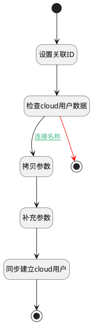

## cloud用户同步 <!-- {docsify-ignore-all} -->

   

### 处理过程

### 处理步骤说明

#### 开始 :id=Begin [开始]

*- N/A*
#### 补充参数 :id=PREPAREPARAM_02 [准备参数]

1. 将`用户全局对象.srforgid` 设置给  `cloud_proxy_user(cloud代理用户).ORGANIZATION_ID(组织标识)`

#### 设置关联ID :id=PREPAREPARAM_01 [准备参数]

1. 将`Default(传入变量).ID(标识)` 设置给  `cloud_proxy_user(cloud代理用户).ID(标识)`

#### 检查cloud用户数据 :id=DEACTION_01 [实体行为]

调用实体 [cloud用户代理(CLOUD_PROXY_USER)](module/cloud_proxy/cloud_proxy_user.md) 行为 [CheckKey](module/cloud_proxy/cloud_proxy_user#行为) ，行为参数为`cloud_proxy_user(cloud代理用户)`

将执行结果返回给参数`exist_cloud_user(是否存在cloud用户)`

#### 拷贝参数 :id=COPYPARAM_01 [拷贝参数]

拷贝参数`Default(传入变量)` 到 `cloud_proxy_user(cloud代理用户)`

且仅拷贝不存在属性

#### 同步建立cloud用户 :id=DEACTION_02 [实体行为]

调用实体 [cloud用户代理(CLOUD_PROXY_USER)](module/cloud_proxy/cloud_proxy_user.md) 行为 [Create](module/cloud_proxy/cloud_proxy_user#行为) ，行为参数为`cloud_proxy_user(cloud代理用户)`

#### 结束 :id=END_02 [结束]

*- N/A*

#### 结束 :id=END_01 [结束]

*- N/A*

### 连接条件说明
#### 连接名称 :id=DEACTION_01-COPYPARAM_01

`exist_cloud_user(是否存在cloud用户)` EQ `0`

### 实体逻辑参数

|    中文名   |    代码名    |  数据类型    |  实体   |备注 |
| --------| --------| -------- | -------- | --------   |
|传入变量(<i class="fa fa-check"/></i>)|Default|数据对象|[用户(RES_USERS)](module/base/res_users.md)||
|cloud代理用户|cloud_proxy_user|数据对象|[cloud用户代理(CLOUD_PROXY_USER)](module/cloud_proxy/cloud_proxy_user.md)||
|是否存在cloud用户|exist_cloud_user|简单数据|||
