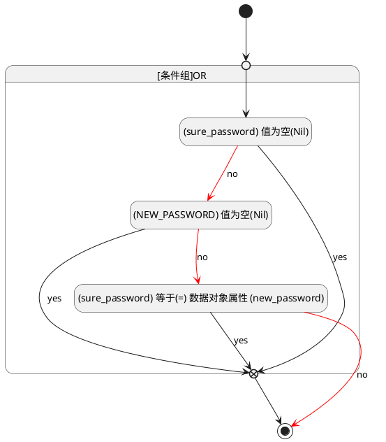

## 密码(PASSWORD) <!-- {docsify-ignore-all} -->

   

### 两次密码不一致 :id=PASSWORD

#### 条件说明

##### (sure_password) 等于(=) 数据对象属性 (new_password) :id=af5a24558a4891dd26762bc732a5daf88

`sure_password` EQ  `new_password`

> [!ATTENTION|label:规则信息|icon:fa fa-warning]
> 两次输入的密码不一致

##### (NEW_PASSWORD) 值为空(Nil) :id=a50d7a25054bc1b338d73be608df4ec97

`NEW_PASSWORD(设置密码)` ISNULL 

##### (sure_password) 值为空(Nil) :id=ac74e8b04fcbe6f936bbeba73d8e11d30

`sure_password` ISNULL 

### 默认规则 :id=Default

```plantuml
@startuml
hide empty description
<style>
root {
  HyperlinkColor #42b983
}
</style>

state "start" as start  <<start>>
state "end" as end <<end>>
state "默认字符串长度" as dd7648c55936f5dbd8e7ec60916428dc [[$./password#add7648c55936f5dbd8e7ec60916428dc {"默认字符串长度"}]]


start --> dd7648c55936f5dbd8e7ec60916428dc 
dd7648c55936f5dbd8e7ec60916428dc --> end 


@enduml
```

#### 条件说明

##### 默认字符串长度 :id=add7648c55936f5dbd8e7ec60916428dc

*关键条件*

`PASSWORD(密码)` 属性长度在区间 `(0 , 500]` 内

> [!ATTENTION|label:规则信息|icon:fa fa-warning]
> 内容长度必须小于等于[500]

