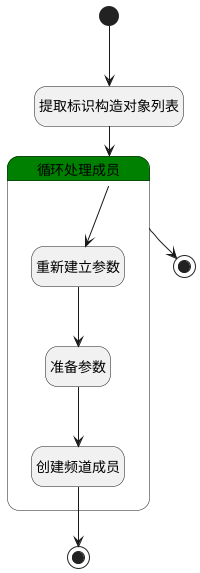

## 添加邀请成员 <!-- {docsify-ignore-all} -->

   

### 处理过程




### 处理步骤说明

#### 提取标识构造对象列表 :id=RAWSFCODE_01<sup class="footnote-symbol"> <font color=gray size=1>[直接后台代码]</font></sup>


<p class="panel-title"><b>执行代码[Groovy]</b></p>

```groovy
    // 获取默认参数中的members字段值
    def src = logic.param("Default").getReal()
    def membersStr = src.get("members")
    
    // 解析ID列表
    def ids = membersStr?.split(',') ?: []
    
    // 构造实体对象列表
    def res_partners = ids.collect { id ->
        // 获取RES_PARTNER实体运行时对象
        def dePartner = sys.dataentity("res_partner")
        // 创建新实体对象
        def partner = dePartner.entity()
        // 设置ID属性（假设RES_PARTNER主键为id）
        partner.set("id", id.trim())
        partner
    }
    
    // 绑定到目标参数
    logic.param("res_partners").getReal().addAll(res_partners)
```

#### 开始 :id=Begin<sup class="footnote-symbol"> <font color=gray size=1>[开始]</font></sup>


*- N/A*
#### 循环处理成员 :id=LOOP_01<sup class="footnote-symbol"> <font color=gray size=1>[循环子调用]</font></sup>


循环参数`res_partners(选中人员)`，子循环参数使用`current_partner(当前处理的成员ID)`
#### 重新建立参数 :id=RENEWPARAM_01<sup class="footnote-symbol"> <font color=gray size=1>[重新建立参数]</font></sup>


重建参数```member(成员)```
#### 准备参数 :id=PREPAREPARAM_02<sup class="footnote-symbol"> <font color=gray size=1>[准备参数]</font></sup>


1. 将`current_partner(当前处理的成员ID).ID(标识)` 设置给  `member(成员).PARTNER_ID(合作伙伴)`
2. 将`Default(传入变量).ID(标识)` 设置给  `member(成员).CHANNEL_ID(频道)`

#### 创建频道成员 :id=CREATE_MEMBER<sup class="footnote-symbol"> <font color=gray size=1>[实体行为]</font></sup>


调用实体 [频道成员(DISCUSS_CHANNEL_MEMBER)](module/discuss/discuss_channel_member.md) 行为 [Save](module/discuss/discuss_channel_member#行为) ，行为参数为`member(成员)`

#### 结束 :id=END<sup class="footnote-symbol"> <font color=gray size=1>[结束]</font></sup>


*- N/A*

#### 循环结束 :id=LOOP_END<sup class="footnote-symbol"> <font color=gray size=1>[结束]</font></sup>


*- N/A*


### 实体逻辑参数

|    中文名   |    代码名    |  数据类型    |  实体   |备注 |
| --------| --------| -------- | -------- | --------   |
|传入变量(<i class="fa fa-check"/></i>)|Default|数据对象|[讨论频道(DISCUSS_CHANNEL)](module/discuss/discuss_channel.md)||
|当前处理的成员ID|current_partner|数据对象|[联系人(RES_PARTNER)](module/base/res_partner.md)||
|成员|member|数据对象|[频道成员(DISCUSS_CHANNEL_MEMBER)](module/discuss/discuss_channel_member.md)||
|选中人员|res_partners|数据对象列表|[联系人(RES_PARTNER)](module/base/res_partner.md)||
