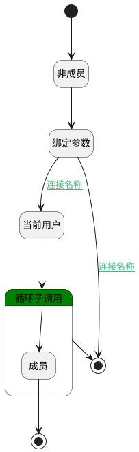

## 计算是否是频道的成员 <!-- {docsify-ignore-all} -->

   

### 处理过程

### 处理步骤说明

#### 开始 :id=Begin [开始]

*- N/A*
#### 非成员 :id=PREPAREPARAM_01 [准备参数]

1. 将`0` 设置给  `Default(传入变量).IS_MEMBER(是会员)`

#### 当前用户 :id=PREPAREPARAM_03 [准备参数]

1. 将`用户全局对象.srfpartnerid` 设置给  `cur_member(当前用户).PARTNER_ID(合作伙伴)`

#### 绑定参数 :id=BINDPARAM_01 [绑定参数]

绑定参数`Default(传入变量)` 到 `channel_members(所有的频道成员)`
#### 循环子调用 :id=LOOPSUBCALL_01 [循环子调用]

循环参数`channel_members(所有的频道成员)`，子循环参数使用`channel_member(频道成员)`
#### 结束 :id=END_01 [结束]

返回 `Default(传入变量).IS_MEMBER`

#### 成员 :id=PREPAREPARAM_02 [准备参数]

1. 将`1` 设置给  `Default(传入变量).IS_MEMBER(是会员)`

#### 结束 :id=END_02 [结束]

返回 `跳出循环（BREAK）`

### 连接条件说明
#### 连接名称 :id=BINDPARAM_01-PREPAREPARAM_03

`channel_members(所有的频道成员).size` GT `0`
#### 连接名称 

#### 连接名称 :id=BINDPARAM_01-END_01

!(`channel_members(所有的频道成员).size` GT `0`)

### 实体逻辑参数

|    中文名   |    代码名    |  数据类型    |  实体   |备注 |
| --------| --------| -------- | -------- | --------   |
|传入变量(<i class="fa fa-check"/></i>)|Default|数据对象|[讨论频道(DISCUSS_CHANNEL)](module/discuss/discuss_channel.md)||
|频道成员|channel_member|数据对象|[频道成员(DISCUSS_CHANNEL_MEMBER)](module/discuss/discuss_channel_member.md)||
|所有的频道成员|channel_members|数据对象列表|[频道成员(DISCUSS_CHANNEL_MEMBER)](module/discuss/discuss_channel_member.md)||
|当前用户|cur_member|数据对象|[频道成员(DISCUSS_CHANNEL_MEMBER)](module/discuss/discuss_channel_member.md)||
