## 新建后加入频道 <!-- {docsify-ignore-all} -->

   

### 处理过程

```plantuml
@startuml
hide empty description
<style>
root {
  HyperlinkColor #42b983
}
</style>

hide empty description
state "开始" as Begin <<start>> [[$./fill_default_member#begin {"开始"}]]
state "准备默认用户" as PREPAREPARAM_01  [[$./fill_default_member#prepareparam_01 {"准备默认用户"}]]
state "建立成员" as DEACTION_01  [[$./fill_default_member#deaction_01 {"建立成员"}]]
state "结束" as END_01 <<end>> [[$./fill_default_member#end_01 {"结束"}]]


Begin --> PREPAREPARAM_01
PREPAREPARAM_01 --> DEACTION_01
DEACTION_01 --> END_01


@enduml
```

### 处理步骤说明

#### 准备默认用户 :id=PREPAREPARAM_01 [准备参数]

1. 将`Default(传入变量).ID(标识)` 设置给  `member(默认成员).CHANNEL_ID(频道)`
2. 将`用户全局对象.srfpartnerid` 设置给  `member(默认成员).PARTNER_ID(合作伙伴)`

#### 开始 :id=Begin [开始]

*- N/A*
#### 建立成员 :id=DEACTION_01 [实体行为]

调用实体 [频道成员(DISCUSS_CHANNEL_MEMBER)](module/discuss/discuss_channel_member.md) 行为 [Create](module/discuss/discuss_channel_member#行为) ，行为参数为`member(默认成员)`

#### 结束 :id=END_01 [结束]

*- N/A*

### 实体逻辑参数

|    中文名   |    代码名    |  数据类型    |  实体   |备注 |
| --------| --------| -------- | -------- | --------   |
|传入变量(<i class="fa fa-check"/></i>)|Default|数据对象|[讨论频道(DISCUSS_CHANNEL)](module/discuss/discuss_channel.md)||
|默认成员|member|数据对象|[频道成员(DISCUSS_CHANNEL_MEMBER)](module/discuss/discuss_channel_member.md)||
