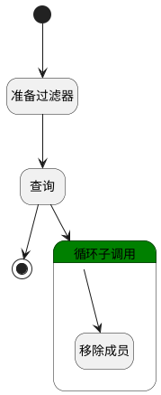

## 离开频道 <!-- {docsify-ignore-all} -->

   后续还需补充退订等逻辑

### 处理过程

### 处理步骤说明

#### 开始 :id=Begin [开始]

*- N/A*
#### 准备过滤器 :id=PREPAREPARAM_01 [准备参数]

1. 将`Default(传入变量).ID(标识)` 设置给  `member_filter(成员过滤器).n_channel_id_eq`
2. 将`用户全局对象.srfpartnerid` 设置给  `member_filter(成员过滤器).n_partner_id_eq`
3. 将`1000` 设置给  `member_filter(成员过滤器).size`

#### 查询 :id=DEDATASET_01 [实体数据集]

调用实体 [频道成员(DISCUSS_CHANNEL_MEMBER)](module/discuss/discuss_channel_member.md) 数据集合 [DEFAULT](module/discuss/discuss_channel_member#数据集合) ，查询参数为`member_filter(成员过滤器)`

将执行结果返回给参数`members(成员集合)`

#### 循环子调用 :id=LOOPSUBCALL_01 [循环子调用]

循环参数`members(成员集合)`，子循环参数使用`member_temp(成员)`
#### 移除成员 :id=DEACTION_01 [实体行为]

调用实体 [频道成员(DISCUSS_CHANNEL_MEMBER)](module/discuss/discuss_channel_member.md) 行为 [Remove](module/discuss/discuss_channel_member#行为) ，行为参数为`member_temp(成员)`

#### 结束 :id=END_01 [结束]

*- N/A*

### 实体逻辑参数

|    中文名   |    代码名    |  数据类型    |  实体   |备注 |
| --------| --------| -------- | -------- | --------   |
|传入变量(<i class="fa fa-check"/></i>)|Default|数据对象|[讨论频道(DISCUSS_CHANNEL)](module/discuss/discuss_channel.md)||
|成员过滤器|member_filter|过滤器|||
|成员|member_temp|数据对象|[频道成员(DISCUSS_CHANNEL_MEMBER)](module/discuss/discuss_channel_member.md)||
|成员集合|members|分页查询|||
