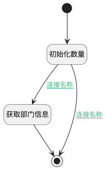

## 部门计数器 <!-- {docsify-ignore-all} -->

   

### 处理过程

### 处理步骤说明

#### 获取部门信息 :id=DEACTION_01 [实体行为]

调用实体 [部门(HR_DEPARTMENT)](module/hr/hr_department.md) 行为 [Get](module/hr/hr_department#行为) ，行为参数为`Default(传入变量)`

将执行结果返回给参数`Default(传入变量)`

#### 初始化数量 :id=PREPAREPARAM_02 [准备参数]

1. 将`0` 设置给  `Default(传入变量).TOTAL_EMPLOYEE(Total Employee)`
2. 将`0` 设置给  `Default(传入变量).PLANS_COUNT(计划数量)`

#### 开始 :id=Begin [开始]

*- N/A*
#### 结束 :id=END_01 [结束]

返回 `Default(传入变量)`

### 连接条件说明
#### 连接名称 :id=PREPAREPARAM_02-DEACTION_01

`Default(传入变量).ID(标识)` ISNOTNULL AND `Default(传入变量).ID(标识)` NOTEQ `undefined`
#### 连接名称 :id=PREPAREPARAM_02-END_01

`Default(传入变量).ID(标识)` EQ `undefined`

### 实体逻辑参数

|    中文名   |    代码名    |  数据类型    |  实体   |备注 |
| --------| --------| -------- | -------- | --------   |
|传入变量(<i class="fa fa-check"/></i>)|Default|数据对象|[部门(HR_DEPARTMENT)](module/hr/hr_department.md)||
|员工|emps|数据对象列表|[员工(HR_EMPLOYEE)](module/hr/hr_employee.md)||
|活动计划|plans|数据对象列表|[活动计划(MAIL_ACTIVITY_PLAN)](module/mail/mail_activity_plan.md)||
