## 建立之前 <!-- {docsify-ignore-all} -->

   

### 处理过程

```plantuml
@startuml
hide empty description
<style>
root {
  HyperlinkColor #42b983
}
</style>

hide empty description
state "开始" as Begin <<start>> [[$./before_create#begin {"开始"}]]
state "准备联系人对象" as PREPAREPARAM_01  [[$./before_create#prepareparam_01 {"准备联系人对象"}]]
state "创建联系人" as DEACTION_01  [[$./before_create#deaction_01 {"创建联系人"}]]
state "回填work_contact_id" as PREPAREPARAM_02  [[$./before_create#prepareparam_02 {"回填work_contact_id"}]]
state "结束" as END_01 <<end>> [[$./before_create#end_01 {"结束"}]]


Begin --> PREPAREPARAM_01 : [[$./before_create#begin-prepareparam_01{连接名称} 连接名称]]
PREPAREPARAM_01 --> DEACTION_01
DEACTION_01 --> PREPAREPARAM_02
PREPAREPARAM_02 --> END_01


@enduml
```

### 处理步骤说明

#### 开始 :id=Begin [开始]

*- N/A*
#### 准备联系人对象 :id=PREPAREPARAM_01 [准备参数]

1. 将`Default(传入变量).WORK_EMAIL(工作电子邮件)` 设置给  `partner(联系人).EMAIL(邮箱)`
2. 将`Default(传入变量).MOBILE_PHONE(办公手机)` 设置给  `partner(联系人).MOBILE(手机)`
3. 将`Default(传入变量).NAME(名称)` 设置给  `partner(联系人).NAME(名称)`
4. 将`Default(传入变量).COMPANY_ID(公司)` 设置给  `partner(联系人).COMPANY_ID(公司)`
5. 将`Default(传入变量).COMPANY_NAME(公司名称)` 设置给  `partner(联系人).COMPANY_NAME(公司名称)`

#### 创建联系人 :id=DEACTION_01 [实体行为]

调用实体 [联系人(RES_PARTNER)](module/base/res_partner.md) 行为 [Create](module/base/res_partner#行为) ，行为参数为`partner(联系人)`

#### 回填work_contact_id :id=PREPAREPARAM_02 [准备参数]

1. 将`partner(联系人).ID(标识)` 设置给  `Default(传入变量).WORK_CONTACT_ID(工作联系人)`

#### 结束 :id=END_01 [结束]

*- N/A*

### 连接条件说明
#### 连接名称 :id=Begin-PREPAREPARAM_01

`Default(传入变量).USER_ID(用户)` ISNULL

### 实体逻辑参数

|    中文名   |    代码名    |  数据类型    |  实体   |备注 |
| --------| --------| -------- | -------- | --------   |
|传入变量(<i class="fa fa-check"/></i>)|Default|数据对象|[员工(HR_EMPLOYEE)](module/hr/hr_employee.md)||
|员工|employees|分页查询|||
|filter|filter|过滤器|||
|联系人|partner|数据对象|[联系人(RES_PARTNER)](module/base/res_partner.md)||
|用户|user|数据对象|[用户(RES_USERS)](module/base/res_users.md)||
