## 公司员工计数器 <!-- {docsify-ignore-all} -->

   

### 处理过程

```plantuml
@startuml
hide empty description
<style>
root {
  HyperlinkColor #42b983
}
</style>

hide empty description
state "开始" as Begin <<start>> [[$./company_staff_counter#begin {"开始"}]]
state "实体数据查询" as DEDATAQUERY_01  [[$./company_staff_counter#dedataquery_01 {"实体数据查询"}]]
state "准备参数" as PREPAREPARAM_01  [[$./company_staff_counter#prepareparam_01 {"准备参数"}]]
state "查看default的值" as DEBUGPARAM_01  [[$./company_staff_counter#debugparam_01 {"查看default的值"}]]
state "准备参数" as PREPAREPARAM_02  [[$./company_staff_counter#prepareparam_02 {"准备参数"}]]
state "结束" as END_01 <<end>> [[$./company_staff_counter#end_01 {"结束"}]]


Begin --> DEBUGPARAM_01
DEBUGPARAM_01 --> PREPAREPARAM_01
PREPAREPARAM_01 --> DEDATAQUERY_01
DEDATAQUERY_01 --> PREPAREPARAM_02
PREPAREPARAM_02 --> END_01


@enduml
```

### 处理步骤说明

#### 实体数据查询 :id=DEDATAQUERY_01 [实体数据查询]

调用实体 [员工(HR_EMPLOYEE)](module/hr/hr_employee.md) 数据查询 [DEFAULT](module/hr/hr_employee#数据查询) ，查询参数为`empFilter`

将执行结果返回给参数`emps(员工)`

#### 开始 :id=Begin [开始]

*- N/A*
#### 准备参数 :id=PREPAREPARAM_01 [准备参数]

1. 将`Default(传入变量).COMPANY_ID(公司)` 设置给  `empFilter.n_company_id_eq`

#### 查看default的值 :id=DEBUGPARAM_01 [调试逻辑参数]

> [!NOTE|label:调试信息|icon:fa fa-bug]
> 调试输出参数`Default(传入变量)`的详细信息

#### 准备参数 :id=PREPAREPARAM_02 [准备参数]

1. 将`emps(员工).size` 设置给  `Default(传入变量).company_staff_count`

#### 结束 :id=END_01 [结束]

返回 `Default(传入变量)`

### 实体逻辑参数

|    中文名   |    代码名    |  数据类型    |  实体   |备注 |
| --------| --------| -------- | -------- | --------   |
|传入变量(<i class="fa fa-check"/></i>)|Default|数据对象|[员工(HR_EMPLOYEE)](module/hr/hr_employee.md)||
|empFilter|empFilter|过滤器|||
|员工|emps|数据对象列表|[员工(HR_EMPLOYEE)](module/hr/hr_employee.md)||
