## 生成徽标 ID <!-- {docsify-ignore-all} -->

   

### 处理过程

```plantuml
@startuml
hide empty description
<style>
root {
  HyperlinkColor #42b983
}
</style>

hide empty description
state "开始" as Begin <<start>> [[$./generate_random_barcode#begin {"开始"}]]
state "生成徽标ID" as RAWSFCODE_01  [[$./generate_random_barcode#rawsfcode_01 {"生成徽标ID"}]]
state "获取员工信息" as DEACTION_01  [[$./generate_random_barcode#deaction_01 {"获取员工信息"}]]
state "更新员工信息" as DEACTION_02  [[$./generate_random_barcode#deaction_02 {"更新员工信息"}]]
state "结束" as END_01 <<end>> [[$./generate_random_barcode#end_01 {"结束"}]]


Begin --> DEACTION_01
DEACTION_01 --> RAWSFCODE_01
RAWSFCODE_01 --> DEACTION_02
DEACTION_02 --> END_01


@enduml
```




### 处理步骤说明

#### 生成徽标ID :id=RAWSFCODE_01<sup class="footnote-symbol"> <font color=gray size=1>[直接后台代码]</font></sup>


<p class="panel-title"><b>执行代码[Groovy]</b></p>

```groovy
def defaultEntity = logic.param('default').getReal();
def  random = new Random();
def  randomDigits = String.format("%09d", random.nextInt(1_000_000_000));
def  barCodeString = "041" + randomDigits;
defaultEntity.set("barcode",barCodeString);

```

#### 开始 :id=Begin<sup class="footnote-symbol"> <font color=gray size=1>[开始]</font></sup>


*- N/A*
#### 获取员工信息 :id=DEACTION_01<sup class="footnote-symbol"> <font color=gray size=1>[实体行为]</font></sup>


调用实体 [员工(HR_EMPLOYEE)](module/hr/hr_employee.md) 行为 [Get](module/hr/hr_employee#行为) ，行为参数为`Default(传入变量)`

将执行结果返回给参数`Default(传入变量)`

#### 更新员工信息 :id=DEACTION_02<sup class="footnote-symbol"> <font color=gray size=1>[实体行为]</font></sup>


调用实体 [员工(HR_EMPLOYEE)](module/hr/hr_employee.md) 行为 [Update](module/hr/hr_employee#行为) ，行为参数为`Default(传入变量)`

将执行结果返回给参数`Default(传入变量)`

#### 结束 :id=END_01<sup class="footnote-symbol"> <font color=gray size=1>[结束]</font></sup>


*- N/A*


### 实体逻辑参数

|    中文名   |    代码名    |  数据类型    |  实体   |备注 |
| --------| --------| -------- | -------- | --------   |
|传入变量(<i class="fa fa-check"/></i>)|Default|数据对象|[员工(HR_EMPLOYEE)](module/hr/hr_employee.md)||
