## 用户变更 <!-- {docsify-ignore-all} -->

   

### 处理过程

```plantuml
@startuml
hide empty description
<style>
root {
  HyperlinkColor #42b983
}
</style>

hide empty description
state "开始" as Begin <<start>> [[$./onchange_user#begin {"开始"}]]
state "准备参数" as PREPAREPARAM_01  [[$./onchange_user#prepareparam_01 {"准备参数"}]]
state "回写work_contact_id" as PREPAREPARAM_02  [[$./onchange_user#prepareparam_02 {"回写work_contact_id"}]]
state "实体行为" as DEACTION_01  [[$./onchange_user#deaction_01 {"实体行为"}]]
state "结束" as END_01 <<end>> [[$./onchange_user#end_01 {"结束"}]]


Begin --> PREPAREPARAM_01 : [[$./onchange_user#begin-prepareparam_01{连接名称} 连接名称]]
PREPAREPARAM_01 --> DEACTION_01
DEACTION_01 --> PREPAREPARAM_02
PREPAREPARAM_02 --> END_01


@enduml
```

### 处理步骤说明

#### 准备参数 :id=PREPAREPARAM_01 [准备参数]

1. 将`Default(传入变量).USER_ID(用户)` 设置给  `user.ID(标识)`

#### 回写work_contact_id :id=PREPAREPARAM_02 [准备参数]

1. 将`user.PARTNER_ID(相关合作伙伴)` 设置给  `Default(传入变量).WORK_CONTACT_ID(工作联系人)`
2. 将`user.NAME(名称)` 设置给  `Default(传入变量).NAME(名称)`

#### 开始 :id=Begin [开始]

*- N/A*
#### 实体行为 :id=DEACTION_01 [实体行为]

调用实体 [用户(RES_USERS)](module/base/res_users.md) 行为 [Get](module/base/res_users#行为) ，行为参数为`user`

将执行结果返回给参数`user`

#### 结束 :id=END_01 [结束]

返回 `Default(传入变量)`

### 连接条件说明
#### 连接名称 :id=Begin-PREPAREPARAM_01

`Default(传入变量).USER_ID(用户)` ISNOTNULL

### 实体逻辑参数

|    中文名   |    代码名    |  数据类型    |  实体   |备注 |
| --------| --------| -------- | -------- | --------   |
|传入变量(<i class="fa fa-check"/></i>)|Default|数据对象|[员工(HR_EMPLOYEE)](module/hr/hr_employee.md)||
|user|user|数据对象|[用户(RES_USERS)](module/base/res_users.md)||
