## 打开员工基本信息视图 <!-- {docsify-ignore-all} -->

   

### 处理过程

```plantuml
@startuml
hide footbox
<style>
root {
  HyperlinkColor #42b983
}
</style>

hide empty description
state "开始" as Begin <<start>> [[$./open_emp_info_view#begin {开始}]]
state "结束" as END_01 <<end>> [[$./open_emp_info_view#end_01 {结束}]]
state "阻止默认行为" as RAWJSCODE_01  [[$./open_emp_info_view#rawjscode_01 {阻止默认行为}]]
state "打开员工基本信息视图" as DEUIACTION_01  [[$./open_emp_info_view#deuiaction_01 {打开员工基本信息视图}]]


Begin --> RAWJSCODE_01
RAWJSCODE_01 --> DEUIACTION_01
DEUIACTION_01 --> END_01


@enduml
```




### 处理步骤说明

#### 开始 :id=Begin<sup class="footnote-symbol"> <font color=gray size=1>[开始]</font></sup>


#### 打开员工基本信息视图 :id=DEUIACTION_01<sup class="footnote-symbol"> <font color=gray size=1>[实体界面行为调用]</font></sup>


调用实体 [员工(HR_EMPLOYEE)](module/hr/hr_employee.md) 界面行为 [打开员工基本信息页面](module/hr/hr_employee#界面行为) ，行为参数为`Default(传入变量)`

#### 阻止默认行为 :id=RAWJSCODE_01<sup class="footnote-symbol"> <font color=gray size=1>[直接前台代码]</font></sup>


<p class="panel-title"><b>执行代码</b></p>

```javascript
event.stopPropagation();
event.preventDefault();
console.log("ctrl",ctrl);
```

#### 结束 :id=END_01<sup class="footnote-symbol"> <font color=gray size=1>[结束]</font></sup>


### 实体逻辑参数

|    中文名   |    代码名    |  数据类型      |备注 |
| --------| --------| --------  | --------   |
|传入变量(<i class="fa fa-check"/></i>)|Default|数据对象||
