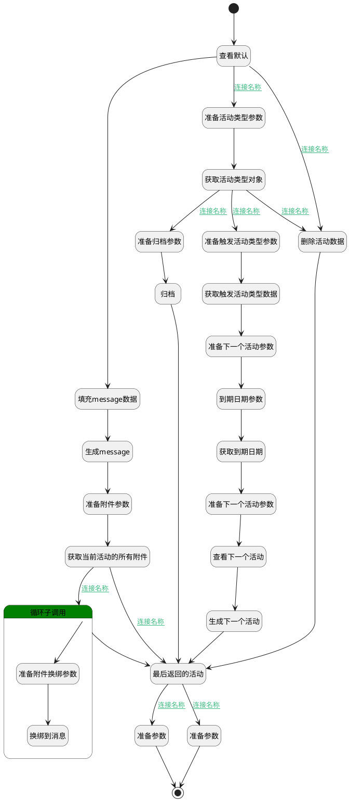

## 完成活动 <!-- {docsify-ignore-all} -->

   1.根据活动类型的keep_done判断活动是归档还是删除;
2.生成活动完成消息到message；
3.活动关联的附件换绑：
由绑定活动改绑成绑定消息
4.当活动类型的链接类型=trigger,生成下一个活动
5.最后返回下一个活动的id,因为"完成并下一个界面行为"需要id来判断是否重新打开新建活动页面


### 处理过程




### 处理步骤说明

#### 查看默认 :id=DEBUGPARAM_03<sup class="footnote-symbol"> <font color=gray size=1>[调试逻辑参数]</font></sup>


> [!NOTE|label:调试信息|icon:fa fa-bug]
> 调试输出参数`Default(传入变量)`的详细信息


#### 开始 :id=Begin<sup class="footnote-symbol"> <font color=gray size=1>[开始]</font></sup>


*- N/A*
#### 准备活动类型参数 :id=PREPAREPARAM_02<sup class="footnote-symbol"> <font color=gray size=1>[准备参数]</font></sup>


1. 将`Default(传入变量).ACTIVITY_TYPE_ID(活动类型)` 设置给  `mail_activity_type.ID(标识)`

#### 获取触发活动类型数据 :id=DEACTION_04<sup class="footnote-symbol"> <font color=gray size=1>[实体行为]</font></sup>


调用实体 [活动类型(MAIL_ACTIVITY_TYPE)](module/mail/mail_activity_type.md) 行为 [Get](module/mail/mail_activity_type#行为) ，行为参数为`triggered_next_type`

将执行结果返回给参数`triggered_next_type`

#### 准备下一个活动参数 :id=PREPAREPARAM_03<sup class="footnote-symbol"> <font color=gray size=1>[准备参数]</font></sup>


1. 将`Default(传入变量).ACTIVITY_TYPE_ID(活动类型)` 设置给  `next_activity(下一个活动).PREVIOUS_ACTIVITY_TYPE_ID(上一个活动类型)`
2. 将`Default(传入变量).RES_ID(资源标识)` 设置给  `next_activity(下一个活动).RES_ID(资源标识)`
3. 将`Default(传入变量).RES_MODEL(资源模型)` 设置给  `next_activity(下一个活动).RES_MODEL(资源模型)`
4. 将`mail_activity_type.TRIGGERED_NEXT_TYPE_ID(触发方式)` 设置给  `next_activity(下一个活动).ACTIVITY_TYPE_ID(活动类型)`
5. 将`triggered_next_type.SUMMARY(默认摘要)` 设置给  `next_activity(下一个活动).SUMMARY(摘要)`
6. 将`triggered_next_type.DEFAULT_NOTE(默认备注)` 设置给  `next_activity(下一个活动).NOTE(备注)`
7. 将`Default(传入变量).srfuserid` 设置给  `next_activity(下一个活动).USER_ID(分派给)`
8. 将`Default(传入变量).RES_NAME(单据名称)` 设置给  `next_activity(下一个活动).RES_NAME(单据名称)`

#### 准备触发活动类型参数 :id=PREPAREPARAM_04<sup class="footnote-symbol"> <font color=gray size=1>[准备参数]</font></sup>


1. 将`mail_activity_type.TRIGGERED_NEXT_TYPE_ID(触发方式)` 设置给  `triggered_next_type.ID(标识)`

#### 获取活动类型对象 :id=DEACTION_01<sup class="footnote-symbol"> <font color=gray size=1>[实体行为]</font></sup>


调用实体 [活动类型(MAIL_ACTIVITY_TYPE)](module/mail/mail_activity_type.md) 行为 [Get](module/mail/mail_activity_type#行为) ，行为参数为`mail_activity_type`

将执行结果返回给参数`mail_activity_type`

#### 准备附件参数 :id=PREPAREPARAM_01<sup class="footnote-symbol"> <font color=gray size=1>[准备参数]</font></sup>


1. 将`Default(传入变量).ID(标识)` 设置给  `attachment_filter.n_res_id_eq`
2. 将`mail_activity` 设置给  `attachment_filter.n_res_model_eq`

#### 生成message :id=RAWSFCODE_03<sup class="footnote-symbol"> <font color=gray size=1>[直接后台代码]</font></sup>


<p class="panel-title"><b>执行代码[Groovy]</b></p>

```groovy
//Groovy
def defaultObj = logic.param('default').getReal();
println("defaultObj数据"+defaultObj);
def mailMessageObj  = logic.param('mail_message').getReal();
// 从参数对象获取model属性值
def modelName = defaultObj.get("srfmodelname")?: defaultObj.get("res_model");
// 通过系统运行时获取实体运行时对象
def deRuntime = sys.dataentity(modelName)
if(deRuntime == null){
    throw new Exception(String.format("消息实体异常"));
}

def messagePostMethod = "message_post_with_source"
Object[] args = [mailMessageObj];
deRuntime.executeAction(messagePostMethod,null,args)


```

#### 填充message数据 :id=RAWSFCODE_01<sup class="footnote-symbol"> <font color=gray size=1>[直接后台代码]</font></sup>


<p class="panel-title"><b>执行代码[Groovy]</b></p>

```groovy
def defaultObj = logic.param('default').getReal();
def mailMessageObj  = logic.param('mail_message').getReal();

def activityTypeName=defaultObj.get('activity_type_name');
def activityTypeId=defaultObj.get('activity_type_id');
def userName=defaultObj.get('user_name');
def userId=defaultObj.get('user_id');
def srfuserid=defaultObj.get('srfuserid');
def summary=defaultObj.get('summary');
def note=defaultObj.get('note');

//反馈内容
def feedBack=defaultObj.get('feedback');
//当前登录用户id
def srfPartnerId=defaultObj.get('srfpartnerid');

// def mailActivityMxin=defaultObj.get('mail_activity_mixin');
// def srfModelName=defaultObj.get('srfmodelname');
def mailActivityMxin=defaultObj.get('mail_activity_mixin')?: defaultObj.get("res_id");
def srfModelName=defaultObj.get('srfmodelname')?: defaultObj.get("res_model");


def displayAssignee = (userId != srfuserid);

def body = activityTypeName + '\t 完成' + 
    (displayAssignee ? '（最初分配给 ' + userName + '）' : '') +
    (summary ? ':' + summary : '');

def notePart = note ? '\t\n原始备注:\n' + note: '';
notePart = notePart?.replaceAll(/<\/?p>/, '') ?: ''
def feedbackPart = feedBack ? '\t\n反馈:\n' + feedBack : '';

body += notePart + feedbackPart;    

mailMessageObj.set('body',body);
mailMessageObj.set('author_id',srfPartnerId);
mailMessageObj.set('mail_activity_type_id',activityTypeId);
mailMessageObj.set('res_id',mailActivityMxin);
mailMessageObj.set('model',srfModelName);

  
 println("mailMessageObj"+mailMessageObj);


```

#### 获取到期日期 :id=DEACTION_010<sup class="footnote-symbol"> <font color=gray size=1>[实体行为]</font></sup>


调用实体 [活动类型(MAIL_ACTIVITY_TYPE)](module/mail/mail_activity_type.md) 行为 [获取到期日期(get_date_deadline)](module/mail/mail_activity_type#行为) ，行为参数为`mail_activity_type`

将执行结果返回给参数`mail_activity_type`

#### 到期日期参数 :id=PREPAREPARAM_09<sup class="footnote-symbol"> <font color=gray size=1>[准备参数]</font></sup>


1. 将`Default(传入变量).DATE_DEADLINE(到期日期)` 设置给  `mail_activity_type.activity_previous_deadline`

#### 获取当前活动的所有附件 :id=DEDATASET_01<sup class="footnote-symbol"> <font color=gray size=1>[实体数据集]</font></sup>


调用实体 [附件(IR_ATTACHMENT)](module/base/ir_attachment.md) 数据集合 [DEFAULT](module/base/ir_attachment#数据集合) ，查询参数为`attachment_filter`

将执行结果返回给参数`attachment_page`

#### 循环子调用 :id=LOOPSUBCALL_01<sup class="footnote-symbol"> <font color=gray size=1>[循环子调用]</font></sup>


循环参数`attachment_page`，子循环参数使用`attachment(attachment_page)`
#### 准备归档参数 :id=RAWSFCODE_02<sup class="footnote-symbol"> <font color=gray size=1>[直接后台代码]</font></sup>


<p class="panel-title"><b>执行代码[Groovy]</b></p>

```groovy
def defaultObj = logic.param('default').getReal();
def sqlTimestamp = new java.sql.Timestamp(System.currentTimeMillis());

defaultObj.set('date_done',sqlTimestamp);
defaultObj.set('active',0);

 println("归档defaultObj"+defaultObj);
```

#### 删除活动数据 :id=DEACTION_03<sup class="footnote-symbol"> <font color=gray size=1>[实体行为]</font></sup>


调用实体 [活动(MAIL_ACTIVITY)](module/mail/mail_activity.md) 行为 [Remove](module/mail/mail_activity#行为) ，行为参数为`Default(传入变量)`

#### 准备下一个活动参数 :id=PREPAREPARAM_07<sup class="footnote-symbol"> <font color=gray size=1>[准备参数]</font></sup>


1. 将`mail_activity_type.actual_deadline` 设置给  `next_activity(下一个活动).DATE_DEADLINE(到期日期)`

#### 查看下一个活动 :id=DEBUGPARAM_01<sup class="footnote-symbol"> <font color=gray size=1>[调试逻辑参数]</font></sup>


> [!NOTE|label:调试信息|icon:fa fa-bug]
> 调试输出参数`next_activity(下一个活动)`的详细信息


#### 归档 :id=DEACTION_02<sup class="footnote-symbol"> <font color=gray size=1>[实体行为]</font></sup>


调用实体 [活动(MAIL_ACTIVITY)](module/mail/mail_activity.md) 行为 [Update](module/mail/mail_activity#行为) ，行为参数为`Default(传入变量)`

#### 准备附件换绑参数 :id=PREPAREPARAM_05<sup class="footnote-symbol"> <font color=gray size=1>[准备参数]</font></sup>


1. 将`mail_message.ID(标识)` 设置给  `attachment(attachment_page).RES_ID(资源标识)`
2. 将`mail_message` 设置给  `attachment(attachment_page).RES_MODEL(资源模型)`

#### 生成下一个活动 :id=DEACTION_08<sup class="footnote-symbol"> <font color=gray size=1>[实体行为]</font></sup>


调用实体 [活动(MAIL_ACTIVITY)](module/mail/mail_activity.md) 行为 [Create](module/mail/mail_activity#行为) ，行为参数为`next_activity(下一个活动)`

将执行结果返回给参数`next_activity(下一个活动)`

#### 换绑到消息 :id=DEACTION_05<sup class="footnote-symbol"> <font color=gray size=1>[实体行为]</font></sup>


调用实体 [附件(IR_ATTACHMENT)](module/base/ir_attachment.md) 行为 [Update](module/base/ir_attachment#行为) ，行为参数为`attachment(attachment_page)`

#### 最后返回的活动 :id=DEBUGPARAM_02<sup class="footnote-symbol"> <font color=gray size=1>[调试逻辑参数]</font></sup>


> [!NOTE|label:调试信息|icon:fa fa-bug]
> 调试输出参数`next_activity(下一个活动)`的详细信息


#### 准备参数 :id=PREPAREPARAM_06<sup class="footnote-symbol"> <font color=gray size=1>[准备参数]</font></sup>


1. 将`空值（NULL）` 设置给  `Default(传入变量).next_act_id`

#### 准备参数 :id=PREPAREPARAM_010<sup class="footnote-symbol"> <font color=gray size=1>[准备参数]</font></sup>


1. 将`next_activity(下一个活动).ID(标识)` 设置给  `Default(传入变量).next_act_id`

#### 结束 :id=END_01<sup class="footnote-symbol"> <font color=gray size=1>[结束]</font></sup>


*- N/A*


### 连接条件说明
#### 连接名称 :id=DEDATASET_01-LOOPSUBCALL_01

`attachment_page(attachment_page).total` GT `0`
#### 连接名称 :id=DEBUGPARAM_02-PREPAREPARAM_06

`next_activity(下一个活动).ID(标识)` ISNULL
#### 连接名称 :id=DEBUGPARAM_02-PREPAREPARAM_010

`next_activity(下一个活动).ID(标识)` ISNOTNULL
#### 连接名称 :id=DEDATASET_01-DEBUGPARAM_02

`attachment_page(attachment_page).total` EQ `0`
#### 连接名称 :id=DEBUGPARAM_03-PREPAREPARAM_02

`Default(传入变量).ACTIVITY_TYPE_ID(活动类型)` ISNOTNULL AND `Default(传入变量).ACTIVITY_TYPE_ID(活动类型)` NOTEQ `undefined`
#### 连接名称 :id=DEACTION_01-PREPAREPARAM_04

`mail_activity_type(mail_activity_type).CHAINING_TYPE(链接类型)` EQ `trigger`
#### 连接名称 :id=DEACTION_01-RAWSFCODE_02

`mail_activity_type(mail_activity_type).KEEP_DONE(保持完成)` EQ `1`
#### 连接名称 :id=DEACTION_01-DEACTION_03

!(`mail_activity_type(mail_activity_type).KEEP_DONE(保持完成)` EQ `1`)
#### 连接名称 :id=DEBUGPARAM_03-DEACTION_03

`Default(传入变量).ACTIVITY_TYPE_ID(活动类型)` ISNULL


### 实体逻辑参数

|    中文名   |    代码名    |  数据类型    |  实体   |备注 |
| --------| --------| -------- | -------- | --------   |
|传入变量(<i class="fa fa-check"/></i>)|Default|数据对象|[活动(MAIL_ACTIVITY)](module/mail/mail_activity.md)||
|attachment_page|attachment|数据对象|[附件(IR_ATTACHMENT)](module/base/ir_attachment.md)||
|attachment_filter|attachment_filter|过滤器|||
|attachment_page|attachment_page|分页查询|||
|mail_activity_type|mail_activity_type|数据对象|[活动类型(MAIL_ACTIVITY_TYPE)](module/mail/mail_activity_type.md)||
|mail_message|mail_message|数据对象|[消息(MAIL_MESSAGE)](module/mail/mail_message.md)||
|mail_thread|mail_thread|数据对象|[邮件会话(MAIL_THREAD)](module/mail/mail_thread.md)||
|下一个活动|next_activity|数据对象|[活动(MAIL_ACTIVITY)](module/mail/mail_activity.md)||
|triggered_next_type|triggered_next_type|数据对象|[活动类型(MAIL_ACTIVITY_TYPE)](module/mail/mail_activity_type.md)||
