## 延迟活动 <!-- {docsify-ignore-all} -->

   

### 处理过程

```plantuml
@startuml
hide empty description
<style>
root {
  HyperlinkColor #42b983
}
</style>

hide empty description
state "开始" as Begin <<start>> [[$./action_snooze#begin {"开始"}]]
state "延迟活动7天" as DEACTION_01  [[$./action_snooze#deaction_01 {"延迟活动7天"}]]
state "准备延迟活动参数" as RAWSFCODE_01  [[$./action_snooze#rawsfcode_01 {"准备延迟活动参数"}]]
state "结束" as END_01 <<end>> [[$./action_snooze#end_01 {"结束"}]]


Begin --> RAWSFCODE_01
RAWSFCODE_01 --> DEACTION_01
DEACTION_01 --> END_01


@enduml
```




### 处理步骤说明

#### 开始 :id=Begin<sup class="footnote-symbol"> <font color=gray size=1>[开始]</font></sup>


*- N/A*
#### 延迟活动7天 :id=DEACTION_01<sup class="footnote-symbol"> <font color=gray size=1>[实体行为]</font></sup>


调用实体 [活动(MAIL_ACTIVITY)](module/mail/mail_activity.md) 行为 [Update](module/mail/mail_activity#行为) ，行为参数为`Default(传入变量)`

#### 准备延迟活动参数 :id=RAWSFCODE_01<sup class="footnote-symbol"> <font color=gray size=1>[直接后台代码]</font></sup>


<p class="panel-title"><b>执行代码[Groovy]</b></p>

```groovy
def defaultObj = logic.param('default').getReal();
if(defaultObj.get('active') == 1){
      def currentDeadline=defaultObj.get('date_deadline');
      def curTime = net.ibizsys.runtime.util.DateUtils.getCurTime();
      java.time.LocalDate today = curTime.toInstant().atZone(java.time.ZoneId.systemDefault()).toLocalDate();
      def deadLineTime = new java.sql.Timestamp(net.ibizsys.runtime.util.DateUtils.getTime(currentDeadline));
      java.time.LocalDate deadLineDate = deadLineTime.toInstant().atZone(java.time.ZoneId.systemDefault()).toLocalDate();
      def maxDay= [deadLineDate, today].max();
      def actualDeadline = maxDay.plus(7, java.time.temporal.ChronoUnit.DAYS);
      defaultObj.set('date_deadline',  actualDeadline);
}
```

#### 结束 :id=END_01<sup class="footnote-symbol"> <font color=gray size=1>[结束]</font></sup>


*- N/A*


### 实体逻辑参数

|    中文名   |    代码名    |  数据类型    |  实体   |备注 |
| --------| --------| -------- | -------- | --------   |
|传入变量(<i class="fa fa-check"/></i>)|Default|数据对象|[活动(MAIL_ACTIVITY)](module/mail/mail_activity.md)||
