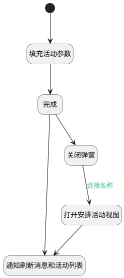

## 完成并安排下一个 <!-- {docsify-ignore-all} -->

   如果执行活动安排标记完成实体行为返回下一个活动的id，则关闭弹窗,反之打开安排活动视图

### 处理过程




### 处理步骤说明

#### 开始 :id=Begin<sup class="footnote-symbol"> <font color=gray size=1>[开始]</font></sup>


#### 填充活动参数 :id=RAWJSCODE_01<sup class="footnote-symbol"> <font color=gray size=1>[直接前台代码]</font></sup>


<p class="panel-title"><b>执行代码</b></p>

```javascript
uiLogic.default.srfpartnerid=context.srfpartnerid;
uiLogic.default.srfuserid=context.srfuserid;
uiLogic.default.mail_activity_mixin=params.mail_activity_mixin;
uiLogic.default.srfmodelname=params.srfmodelname;
console.log("uiLogic.default",uiLogic.default);
```

#### 完成 :id=DEACTION_01<sup class="footnote-symbol"> <font color=gray size=1>[实体行为]</font></sup>


调用实体 [活动(MAIL_ACTIVITY)](module/mail/mail_activity.md) 行为 [完成活动(action_done)](module/mail/mail_activity#行为) ，行为参数为`Default(传入变量)`

将执行结果返回给参数`Default(传入变量)`

#### 通知刷新消息和活动列表 :id=RAWJSCODE_04<sup class="footnote-symbol"> <font color=gray size=1>[直接前台代码]</font></sup>


<p class="panel-title"><b>执行代码</b></p>

```javascript
try{
    const activity_state =parentView.layoutPanel.findPanelItemByName("activity").panelItems.activity_state;
    if (activity_state && activity_state.value == null) {
        activity_state.setDataValue("planned");
    }
}catch(err){
    console.log("未处于统一邮件集成界面");
}
ibiz.mc.command.create.send({ srfdecodename: 'mail_message'});
ibiz.mc.command.create.send({ srfdecodename: 'mail_activity'});
```

#### 关闭弹窗 :id=RAWJSCODE_02<sup class="footnote-symbol"> <font color=gray size=1>[直接前台代码]</font></sup>


<p class="panel-title"><b>执行代码</b></p>

```javascript
var formCtrl = view.getCtrl("FORM", "form");
if(formCtrl){
    formCtrl.state.modified=false;
}
view.closeView({ ok: true});
```

#### 打开安排活动视图 :id=DEUIACTION_01<sup class="footnote-symbol"> <font color=gray size=1>[实体界面行为调用]</font></sup>


调用实体 [活动日程计划向导(MAIL_ACTIVITY_SCHEDULE)](module/mail/mail_activity_schedule.md) 界面行为 [打开安排活动视图](module/mail/mail_activity_schedule#界面行为) ，行为参数为`ctx(上下文)`

### 连接条件说明
#### 连接名称 :id=RAWJSCODE_02-DEUIACTION_01

```Default(传入变量).next_act_id``` ISNULL


### 实体逻辑参数

|    中文名   |    代码名    |  数据类型      |备注 |
| --------| --------| --------  | --------   |
|original_default|original_default|数据对象||
|传入变量(<i class="fa fa-check"/></i>)|Default|数据对象||
|上下文|ctx|导航视图参数绑定参数||
|form|form|部件对象||
