## 刷新活动和消息列表 <!-- {docsify-ignore-all} -->

   刷新

### 处理过程

```plantuml
@startuml
hide footbox
<style>
root {
  HyperlinkColor #42b983
}
</style>

hide empty description
state "开始" as Begin <<start>> [[$./refresh_activity_message#begin {开始}]]
state "注入脚本代码" as RAWJSCODE1  [[$./refresh_activity_message#rawjscode1 {注入脚本代码}]]


Begin --> RAWJSCODE1


@enduml
```




### 处理步骤说明

#### 注入脚本代码 :id=RAWJSCODE1<sup class="footnote-symbol"> <font color=gray size=1>[直接前台代码]</font></sup>


<p class="panel-title"><b>执行代码</b></p>

```javascript
console.log("更新活动状态");
try{
    const activity_state =parentView.layoutPanel.findPanelItemByName("activity").panelItems.activity_state;
    if (activity_state && activity_state.value == null) {
        activity_state.setDataValue("planned");
    }
}catch(err){
    console.log("未处于统一邮件集成界面");
}

ibiz.mc.command.create.send({ srfdecodename: 'mail_message'});
ibiz.mc.command.create.send({ srfdecodename: 'mail_activity'})

```

#### 开始 :id=Begin<sup class="footnote-symbol"> <font color=gray size=1>[开始]</font></sup>


### 实体逻辑参数

|    中文名   |    代码名    |  数据类型      |备注 |
| --------| --------| --------  | --------   |
|ctx|ctx|导航视图参数绑定参数||
|传入变量(<i class="fa fa-check"/></i>)|Default|数据对象||
