## 处理活动状态 <!-- {docsify-ignore-all} -->

   

### 处理过程

```plantuml
@startuml
hide empty description
<style>
root {
  HyperlinkColor #42b983
}
</style>

hide empty description
state "开始" as Begin <<start>> [[$./process_activities#begin {"开始"}]]
state "绑定参数" as BINDPARAM_01  [[$./process_activities#bindparam_01 {"绑定参数"}]]
state "执行脚本代码" as RAWSFCODE_01  [[$./process_activities#rawsfcode_01 {"执行脚本代码"}]]
state "结束" as END <<end>> [[$./process_activities#end {"结束"}]]


Begin --> BINDPARAM_01
BINDPARAM_01 --> RAWSFCODE_01
RAWSFCODE_01 --> END


@enduml
```




### 处理步骤说明

#### 绑定参数 :id=BINDPARAM_01<sup class="footnote-symbol"> <font color=gray size=1>[绑定参数]</font></sup>


绑定参数`Default(传入变量)` 到 `activities`
#### 执行脚本代码 :id=RAWSFCODE_01<sup class="footnote-symbol"> <font color=gray size=1>[直接后台代码]</font></sup>


<p class="panel-title"><b>执行代码[Groovy]</b></p>

```groovy
def activitiesList = logic.param("activities").getReal()
def _default = logic.param("default").getReal()
def states = activitiesList.collect { it.get("state") } as Set

if (states.contains("overdue")) {
    _default.set("activity_state", "overdue")
} else if (states.contains("today")) {
    _default.set("activity_state", "today")
} else if (states.contains("planned")) {
    _default.set("activity_state","planned")
} else {
    _default.reset("activity_state")
}
```

#### 开始 :id=Begin<sup class="footnote-symbol"> <font color=gray size=1>[开始]</font></sup>


*- N/A*
#### 结束 :id=END<sup class="footnote-symbol"> <font color=gray size=1>[结束]</font></sup>


返回 `Default(传入变量).activity_state`


### 实体逻辑参数

|    中文名   |    代码名    |  数据类型    |  实体   |备注 |
| --------| --------| -------- | -------- | --------   |
|传入变量(<i class="fa fa-check"/></i>)|Default|数据对象|[活动Mixin(MAIL_ACTIVITY_MIXIN)](module/mail/mail_activity_mixin.md)||
|activities|activities|数据对象列表|[活动(MAIL_ACTIVITY)](module/mail/mail_activity.md)||
|当前活动项|currentActivity|数据对象|[活动(MAIL_ACTIVITY)](module/mail/mail_activity.md)||
