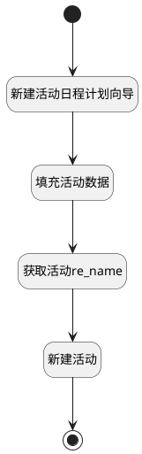

## 安排 <!-- {docsify-ignore-all} -->

   

### 处理过程




### 处理步骤说明

#### 开始 :id=Begin<sup class="footnote-symbol"> <font color=gray size=1>[开始]</font></sup>


*- N/A*
#### 新建活动日程计划向导 :id=DEACTION_01<sup class="footnote-symbol"> <font color=gray size=1>[实体行为]</font></sup>


调用实体 [活动日程计划向导(MAIL_ACTIVITY_SCHEDULE)](module/mail/mail_activity_schedule.md) 行为 [Create](module/mail/mail_activity_schedule#行为) ，行为参数为`Default(传入变量)`

#### 填充活动数据 :id=PREPAREPARAM_01<sup class="footnote-symbol"> <font color=gray size=1>[准备参数]</font></sup>


1. 将`Default(传入变量).ACTIVITY_TYPE_ID(活动类型)` 设置给  `mail_activity(活动).ACTIVITY_TYPE_ID(活动类型)`
2. 将`0` 设置给  `mail_activity(活动).AUTOMATED(自动活动)`
3. 将`Default(传入变量).SUMMARY(摘要)` 设置给  `mail_activity(活动).SUMMARY(摘要)`
4. 将`Default(传入变量).NOTE(备注)` 设置给  `mail_activity(活动).NOTE(备注)`
5. 将`Default(传入变量).ACTIVITY_USER_ID(分派给)` 设置给  `mail_activity(活动).USER_ID(分派给)`
6. 将`Default(传入变量).DATE_DEADLINE(到期日期)` 设置给  `mail_activity(活动).DATE_DEADLINE(到期日期)`
7. 将`Default(传入变量).RES_IDS(文档 ID)` 设置给  `mail_activity(活动).RES_ID(资源标识)`
8. 将`Default(传入变量).RES_MODEL(模型)` 设置给  `mail_activity(活动).RES_MODEL(资源模型)`

#### 新建活动 :id=DEACTION_02<sup class="footnote-symbol"> <font color=gray size=1>[实体行为]</font></sup>


调用实体 [活动(MAIL_ACTIVITY)](module/mail/mail_activity.md) 行为 [Create](module/mail/mail_activity#行为) ，行为参数为`mail_activity(活动)`

#### 结束 :id=END_01<sup class="footnote-symbol"> <font color=gray size=1>[结束]</font></sup>


返回 `Default(传入变量)`

#### 获取活动re_name :id=RAWSFCODE_01<sup class="footnote-symbol"> <font color=gray size=1>[直接后台代码]</font></sup>


<p class="panel-title"><b>执行代码[Groovy]</b></p>

```groovy
def mailActivity = logic.param('mail_activity').getReal();
def entityModelName=mailActivity.get("res_model");
def entityId=mailActivity.get("res_id");
def entityRuntime = sys.dataentity(entityModelName);
def entityObj = entityRuntime.get(entityId);
mailActivity.set('res_name',entityObj.get('name'));

```


### 实体逻辑参数

|    中文名   |    代码名    |  数据类型    |  实体   |备注 |
| --------| --------| -------- | -------- | --------   |
|传入变量(<i class="fa fa-check"/></i>)|Default|数据对象|[活动日程计划向导(MAIL_ACTIVITY_SCHEDULE)](module/mail/mail_activity_schedule.md)||
|活动|mail_activity|数据对象|[活动(MAIL_ACTIVITY)](module/mail/mail_activity.md)||
