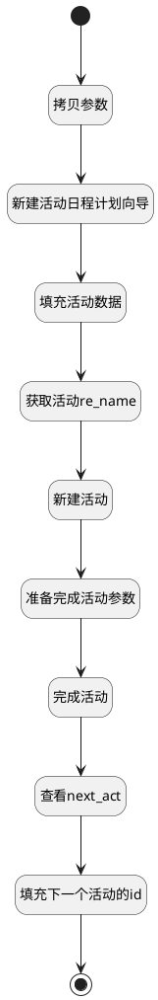

## 安排并标记完成 <!-- {docsify-ignore-all} -->

   1.新建活动；
2.活动标记完成，并且根据活动类型生成下一个活动；
3.返回下一个活动的id；

### 处理过程




### 处理步骤说明

#### 拷贝参数 :id=COPYPARAM_01<sup class="footnote-symbol"> <font color=gray size=1>[拷贝参数]</font></sup>


拷贝参数`Default(传入变量)` 到 `original_default`

#### 新建活动日程计划向导 :id=DEACTION_01<sup class="footnote-symbol"> <font color=gray size=1>[实体行为]</font></sup>


调用实体 [活动日程计划向导(MAIL_ACTIVITY_SCHEDULE)](module/mail/mail_activity_schedule.md) 行为 [Create](module/mail/mail_activity_schedule#行为) ，行为参数为`Default(传入变量)`

#### 填充活动数据 :id=PREPAREPARAM_01<sup class="footnote-symbol"> <font color=gray size=1>[准备参数]</font></sup>


1. 将`Default(传入变量).ACTIVITY_TYPE_ID(活动类型)` 设置给  `mail_activity(活动).ACTIVITY_TYPE_ID(活动类型)`
2. 将`0` 设置给  `mail_activity(活动).AUTOMATED(自动活动)`
3. 将`Default(传入变量).SUMMARY(摘要)` 设置给  `mail_activity(活动).SUMMARY(摘要)`
4. 将`Default(传入变量).NOTE(备注)` 设置给  `mail_activity(活动).NOTE(备注)`
5. 将`Default(传入变量).ACTIVITY_USER_ID(分派给)` 设置给  `mail_activity(活动).USER_ID(分派给)`
6. 将`Default(传入变量).DATE_DEADLINE(到期日期)` 设置给  `mail_activity(活动).DATE_DEADLINE(到期日期)`
7. 将`Default(传入变量).RES_IDS(文档 ID)` 设置给  `mail_activity(活动).RES_ID(资源标识)`
8. 将`Default(传入变量).RES_MODEL(模型)` 设置给  `mail_activity(活动).RES_MODEL(资源模型)`

#### 开始 :id=Begin<sup class="footnote-symbol"> <font color=gray size=1>[开始]</font></sup>


*- N/A*
#### 准备完成活动参数 :id=PREPAREPARAM_02<sup class="footnote-symbol"> <font color=gray size=1>[准备参数]</font></sup>


1. 将`Default(传入变量).RES_IDS(文档 ID)` 设置给  `mail_activity(活动).mail_activity_mixin`
2. 将`Default(传入变量).RES_MODEL(模型)` 设置给  `mail_activity(活动).srfmodelname`
3. 将`original_default.srfpartnerid` 设置给  `mail_activity(活动).srfpartnerid`
4. 将`original_default.srfuserid` 设置给  `mail_activity(活动).srfuserid`

#### 新建活动 :id=DEACTION_02<sup class="footnote-symbol"> <font color=gray size=1>[实体行为]</font></sup>


调用实体 [活动(MAIL_ACTIVITY)](module/mail/mail_activity.md) 行为 [Create](module/mail/mail_activity#行为) ，行为参数为`mail_activity(活动)`

将执行结果返回给参数`mail_activity(活动)`

#### 获取活动re_name :id=RAWSFCODE_01<sup class="footnote-symbol"> <font color=gray size=1>[直接后台代码]</font></sup>


<p class="panel-title"><b>执行代码[Groovy]</b></p>

```groovy
def mailActivity = logic.param('mail_activity').getReal();
def entityModelName=mailActivity.get("res_model");
def entityId=mailActivity.get("res_id");
def entityRuntime = sys.dataentity(entityModelName);
def entityObj = entityRuntime.get(entityId);
mailActivity.set('res_name',entityObj.get('name'));

```

#### 查看next_act :id=DEBUGPARAM_01<sup class="footnote-symbol"> <font color=gray size=1>[调试逻辑参数]</font></sup>


> [!NOTE|label:调试信息|icon:fa fa-bug]
> 调试输出参数`next_activity`的详细信息


#### 填充下一个活动的id :id=PREPAREPARAM_03<sup class="footnote-symbol"> <font color=gray size=1>[准备参数]</font></sup>


1. 将`next_activity.next_act_id` 设置给  `Default(传入变量).next_act_id`

#### 结束 :id=END_01<sup class="footnote-symbol"> <font color=gray size=1>[结束]</font></sup>


*- N/A*

#### 完成活动 :id=DEACTION_03<sup class="footnote-symbol"> <font color=gray size=1>[实体行为]</font></sup>


调用实体 [活动(MAIL_ACTIVITY)](module/mail/mail_activity.md) 行为 [完成活动(action_done)](module/mail/mail_activity#行为) ，行为参数为`mail_activity(活动)`

将执行结果返回给参数`next_activity`


### 实体逻辑参数

|    中文名   |    代码名    |  数据类型    |  实体   |备注 |
| --------| --------| -------- | -------- | --------   |
|传入变量(<i class="fa fa-check"/></i>)|Default|数据对象|[活动日程计划向导(MAIL_ACTIVITY_SCHEDULE)](module/mail/mail_activity_schedule.md)||
|活动|mail_activity|数据对象|[活动(MAIL_ACTIVITY)](module/mail/mail_activity.md)||
|next_activity|next_activity|数据对象|[活动(MAIL_ACTIVITY)](module/mail/mail_activity.md)||
|original_default|original_default|数据对象|[活动日程计划向导(MAIL_ACTIVITY_SCHEDULE)](module/mail/mail_activity_schedule.md)||
