## 完成并安排下一个 <!-- {docsify-ignore-all} -->

   如果执行活动安排标记完成实体行为返回下一个活动的id，则关闭弹窗,反之刷新当前表单

### 处理过程

```plantuml
@startuml
hide footbox
<style>
root {
  HyperlinkColor #42b983
}
</style>

hide empty description
state "开始" as Begin <<start>> [[$./done_next#begin {开始}]]
state "安排并标记完成" as DEACTION_01  [[$./done_next#deaction_01 {安排并标记完成}]]
state "通知刷新消息和活动列表" as RAWJSCODE_04  [[$./done_next#rawjscode_04 {通知刷新消息和活动列表}]]
state "关闭弹窗" as RAWJSCODE_02  [[$./done_next#rawjscode_02 {关闭弹窗}]]
state "刷新表单" as VIEWCTRLINVOKE_01  [[$./done_next#viewctrlinvoke_01 {刷新表单}]]
state "填充活动参数" as RAWJSCODE_01  [[$./done_next#rawjscode_01 {填充活动参数}]]


Begin --> RAWJSCODE_01
RAWJSCODE_01 --> DEACTION_01
DEACTION_01 --> RAWJSCODE_04
RAWJSCODE_04 --> RAWJSCODE_02 : [[$./done_next#rawjscode_04-rawjscode_02{连接名称} 连接名称]]
RAWJSCODE_04 --> VIEWCTRLINVOKE_01 : [[$./done_next#rawjscode_04-viewctrlinvoke_01{连接名称} 连接名称]]


@enduml
```




### 处理步骤说明

#### 填充活动参数 :id=RAWJSCODE_01<sup class="footnote-symbol"> <font color=gray size=1>[直接前台代码]</font></sup>


<p class="panel-title"><b>执行代码</b></p>

```javascript
uiLogic.default.srfpartnerid=context.srfpartnerid;
uiLogic.default.srfuserid=context.srfuserid;


```

#### 开始 :id=Begin<sup class="footnote-symbol"> <font color=gray size=1>[开始]</font></sup>


#### 安排并标记完成 :id=DEACTION_01<sup class="footnote-symbol"> <font color=gray size=1>[实体行为]</font></sup>


调用实体 [活动日程计划向导(MAIL_ACTIVITY_SCHEDULE)](module/mail/mail_activity_schedule.md) 行为 [安排并标记完成(schedule_activities_done)](module/mail/mail_activity_schedule#行为) ，行为参数为`Default(传入变量)`

将执行结果返回给参数`Default(传入变量)`

#### 通知刷新消息和活动列表 :id=RAWJSCODE_04<sup class="footnote-symbol"> <font color=gray size=1>[直接前台代码]</font></sup>


<p class="panel-title"><b>执行代码</b></p>

```javascript
try{
    const activity_state =parentView.layoutPanel.findPanelItemByName("activity").panelItems.activity_state;
    if (activity_state && activity_state.value == null) {
        activity_state.setDataValue("planned");
    }
}catch(err){
    console.log("未处于统一邮件集成界面");
}
ibiz.mc.command.create.send({ srfdecodename: 'mail_message'});
ibiz.mc.command.create.send({ srfdecodename: 'mail_activity'});
```

#### 关闭弹窗 :id=RAWJSCODE_02<sup class="footnote-symbol"> <font color=gray size=1>[直接前台代码]</font></sup>


<p class="panel-title"><b>执行代码</b></p>

```javascript
var formCtrl = view.getCtrl("FORM", "form");
if(formCtrl){
    formCtrl.state.modified=false;
}
view.closeView({ ok: true, data: [] });
```

#### 刷新表单 :id=VIEWCTRLINVOKE_01<sup class="footnote-symbol"> <font color=gray size=1>[视图部件调用]</font></sup>


调用`form`的方法`refresh`，参数为`Default(传入变量)`
### 连接条件说明
#### 连接名称 :id=RAWJSCODE_04-RAWJSCODE_02

```Default(传入变量).next_act_id``` ISNOTNULL
#### 连接名称 :id=RAWJSCODE_04-VIEWCTRLINVOKE_01

```Default(传入变量).next_act_id``` ISNULL


### 实体逻辑参数

|    中文名   |    代码名    |  数据类型      |备注 |
| --------| --------| --------  | --------   |
|form|form|部件对象||
|传入变量(<i class="fa fa-check"/></i>)|Default|数据对象||
|view|view|当前视图对象||
