## 获取到期日期 <!-- {docsify-ignore-all} -->

   

### 处理过程

```plantuml
@startuml
hide empty description
<style>
root {
  HyperlinkColor #42b983
}
</style>

hide empty description
state "开始" as Begin <<start>> [[$./get_date_deadline#begin {"开始"}]]
state "拷贝参数" as COPYPARAM_01  [[$./get_date_deadline#copyparam_01 {"拷贝参数"}]]
state "结束" as END_01 <<end>> [[$./get_date_deadline#end_01 {"结束"}]]
state "生成到期日期" as RAWSFCODE_01  [[$./get_date_deadline#rawsfcode_01 {"生成到期日期"}]]
state "获取活动类型" as DEACTION_01  [[$./get_date_deadline#deaction_01 {"获取活动类型"}]]


Begin --> COPYPARAM_01
COPYPARAM_01 --> DEACTION_01
DEACTION_01 --> RAWSFCODE_01
RAWSFCODE_01 --> END_01


@enduml
```




### 处理步骤说明

#### 拷贝参数 :id=COPYPARAM_01<sup class="footnote-symbol"> <font color=gray size=1>[拷贝参数]</font></sup>

防止activity_previous_deadline值被覆盖

拷贝参数`Default(传入变量)` 到 `original_default`

#### 结束 :id=END_01<sup class="footnote-symbol"> <font color=gray size=1>[结束]</font></sup>


*- N/A*

#### 开始 :id=Begin<sup class="footnote-symbol"> <font color=gray size=1>[开始]</font></sup>


*- N/A*
#### 生成到期日期 :id=RAWSFCODE_01<sup class="footnote-symbol"> <font color=gray size=1>[直接后台代码]</font></sup>


<p class="panel-title"><b>执行代码[Groovy]</b></p>

```groovy
def defaultObj = logic.param('default').getReal();
def originalDefault = logic.param('original_default').getReal();
def delayFrom=defaultObj.get('delay_from');
def activityPreviousDeadline=originalDefault.get('activity_previous_deadline');
def delayUnit=defaultObj.get('delay_unit');
def delayCount=defaultObj.get('delay_count');
def chronoUnit;
def actualDeadline;

if(delayUnit == 'days' ) {
    chronoUnit = java.time.temporal.ChronoUnit.DAYS
} 
else if(delayUnit == 'weeks' ) {
    chronoUnit = java.time.temporal.ChronoUnit.WEEKS
}
else if(delayUnit == 'months' ) {
    chronoUnit = java.time.temporal.ChronoUnit.MONTHS
}
else if(delayUnit == 'years' ) {
    chronoUnit = java.time.temporal.ChronoUnit.YEARS
}

if(delayFrom == 'previous_activity' && activityPreviousDeadline){
    def deadLineTime = new java.sql.Timestamp(net.ibizsys.runtime.util.DateUtils.getTime(activityPreviousDeadline));
    java.time.LocalDate deadLineDate = deadLineTime.toInstant().atZone(java.time.ZoneId.systemDefault()).toLocalDate();
    actualDeadline = deadLineDate.plus(delayCount, chronoUnit);
}else{
    def curTime = net.ibizsys.runtime.util.DateUtils.getCurTime();
    java.time.LocalDate localDate = curTime.toInstant().atZone(java.time.ZoneId.systemDefault()).toLocalDate();
    actualDeadline = localDate.plus(delayCount, chronoUnit);
}

defaultObj.set('actual_deadline',actualDeadline);
println("actual_deadline值："+actualDeadline);


```

#### 获取活动类型 :id=DEACTION_01<sup class="footnote-symbol"> <font color=gray size=1>[实体行为]</font></sup>


调用实体 [活动类型(MAIL_ACTIVITY_TYPE)](module/mail/mail_activity_type.md) 行为 [Get](module/mail/mail_activity_type#行为) ，行为参数为`Default(传入变量)`

将执行结果返回给参数`mail_activity_type`


### 实体逻辑参数

|    中文名   |    代码名    |  数据类型    |  实体   |备注 |
| --------| --------| -------- | -------- | --------   |
|传入变量(<i class="fa fa-check"/></i>)|Default|数据对象|[活动类型(MAIL_ACTIVITY_TYPE)](module/mail/mail_activity_type.md)||
|mail_activity_type|mail_activity_type|数据对象|[活动类型(MAIL_ACTIVITY_TYPE)](module/mail/mail_activity_type.md)||
|original_default|original_default|数据对象|[活动类型(MAIL_ACTIVITY_TYPE)](module/mail/mail_activity_type.md)||
