## 关注人员更新(嵌入) <!-- {docsify-ignore-all} -->

   获取关注人员信息，并根据类别更新

### 处理过程

```plantuml
@startuml
hide footbox
<style>
root {
  HyperlinkColor #42b983
}
</style>

hide empty description
state "开始" as Begin <<start>> [[$./attention_personnel_update_emb#begin {开始}]]
state "结束" as END1 <<end>> [[$./attention_personnel_update_emb#end1 {结束}]]
state "更新关注人员" as RAWJSCODE_01  [[$./attention_personnel_update_emb#rawjscode_01 {更新关注人员}]]
state "获取关注人员" as PREPAREJSPARAM2  [[$./attention_personnel_update_emb#preparejsparam2 {获取关注人员}]]


Begin --> PREPAREJSPARAM2
PREPAREJSPARAM2 --> RAWJSCODE_01
RAWJSCODE_01 --> END1


@enduml
```




### 处理步骤说明

#### 开始 :id=Begin<sup class="footnote-symbol"> <font color=gray size=1>[开始]</font></sup>


#### 获取关注人员 :id=PREPAREJSPARAM2<sup class="footnote-symbol"> <font color=gray size=1>[准备参数]</font></sup>


1. 将`view(当前视图对象).layoutPanel.panelItems.container_thread` 绑定给  `container_thread(容器对象)`
2. 将`container_thread(容器对象).panelItems.mail_followers` 设置给  `followers(关注人)`
3. 将`followers(关注人).value` 设置给  `commit_object(提交对象).followers`

#### 更新关注人员 :id=RAWJSCODE_01<sup class="footnote-symbol"> <font color=gray size=1>[直接前台代码]</font></sup>


<p class="panel-title"><b>执行代码</b></p>

```javascript
// 创建新上下文对象并拷贝原始context内容
const _app = ibiz.hub.getApp(view.parentView.context.srfappid);
const appName = view.parentView.context.srfappid.split('__').pop(); // 取最后一段
const deName = view.params.srfmodelname;
console.log("");
// 调用实体服务更新行为
if (uiLogic.commit_object) {
  uiLogic.commit_object.followers = uiLogic.commit_object.followers.map(follower => {
  return {
    ...follower
  };
});
  await _app.deService.exec( appName+'.'+deName, 'update', context , uiLogic.commit_object); 
};

```

#### 结束 :id=END1<sup class="footnote-symbol"> <font color=gray size=1>[结束]</font></sup>


### 实体逻辑参数

|    中文名   |    代码名    |  数据类型      |备注 |
| --------| --------| --------  | --------   |
|容器5|container5|数据对象||
|关注人|followers|数据对象||
|当前视图对象|view|当前视图对象||
|容器对象|container_thread|数据对象||
|传入变量(<i class="fa fa-check"/></i>)|Default|数据对象||
|提交对象|commit_object|数据对象||
|应用上下文|ctx|导航视图参数绑定参数||
|容器1|thread_panel|数据对象||
