## 新建评论后通知 <!-- {docsify-ignore-all} -->

   发表评论后，发送通知消息至相应负责人员、关注人员

### 处理过程

```plantuml
@startuml
hide empty description
<style>
root {
  HyperlinkColor #42b983
}
</style>

hide empty description
state "开始" as Begin <<start>> [[$./after_create_notify#begin {"开始"}]]
state "评论通知" as DENOTIFY  [[$./after_create_notify#denotify {"评论通知"}]]


Begin --> DENOTIFY


@enduml
```

### 处理步骤说明

#### 开始 :id=Begin [开始]

*- N/A*
#### 评论通知 :id=DENOTIFY [实体通知]

调用实体 [消息(MAIL_MESSAGE)](module/mail/mail_message.md) 通知 [评论通知(message_notify)](module/mail/mail_message/notify/message_notify) ，参数为`Default(传入变量)`

### 实体逻辑参数

|    中文名   |    代码名    |  数据类型    |  实体   |备注 |
| --------| --------| -------- | -------- | --------   |
|传入变量(<i class="fa fa-check"/></i>)|Default|数据对象|[消息(MAIL_MESSAGE)](module/mail/mail_message.md)||
