## 置顶 <!-- {docsify-ignore-all} -->

   

### 处理过程

```plantuml
@startuml
hide empty description
<style>
root {
  HyperlinkColor #42b983
}
</style>

hide empty description
state "开始" as Begin <<start>> [[$./pin#begin {"开始"}]]
state "设置置顶时间" as PREPAREPARAM_01  [[$./pin#prepareparam_01 {"设置置顶时间"}]]
state "更新" as DEACTION_01  [[$./pin#deaction_01 {"更新"}]]
state "结束" as END_01 <<end>> [[$./pin#end_01 {"结束"}]]


Begin --> PREPAREPARAM_01
PREPAREPARAM_01 --> DEACTION_01
DEACTION_01 --> END_01


@enduml
```

### 处理步骤说明

#### 设置置顶时间 :id=PREPAREPARAM_01 [准备参数]

1. 将`计算式 null` 设置给  `Default(传入变量).PINNED_AT(已置顶)`

#### 更新 :id=DEACTION_01 [实体行为]

调用实体 [消息(MAIL_MESSAGE)](module/mail/mail_message.md) 行为 [Update](module/mail/mail_message#行为) ，行为参数为`Default(传入变量)`

#### 开始 :id=Begin [开始]

*- N/A*
#### 结束 :id=END_01 [结束]

*- N/A*

### 实体逻辑参数

|    中文名   |    代码名    |  数据类型    |  实体   |备注 |
| --------| --------| -------- | -------- | --------   |
|传入变量(<i class="fa fa-check"/></i>)|Default|数据对象|[消息(MAIL_MESSAGE)](module/mail/mail_message.md)||
