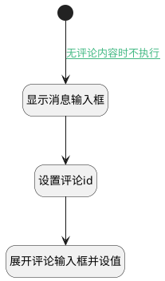

## 编辑评论 <!-- {docsify-ignore-all} -->

   编辑评论，获取评论数据，展开评论输入框并赋值

### 处理过程




### 处理步骤说明

#### 开始 :id=Begin<sup class="footnote-symbol"> <font color=gray size=1>[开始]</font></sup>


#### 显示消息输入框 :id=RAWJSCODE_01<sup class="footnote-symbol"> <font color=gray size=1>[直接前台代码]</font></sup>


<p class="panel-title"><b>执行代码</b></p>

```javascript
// 获取目标面板项
const panelItem = view.layoutPanel.findPanelItemByName("message_panel");
if (panelItem) {
  // 切换可见状态
  panelItem.state.visible =true;
}
```

#### 设置评论id :id=PREPAREJSPARAM1<sup class="footnote-symbol"> <font color=gray size=1>[准备参数]</font></sup>


1. 将`空值（NULL）` 设置给  `view(当前视图对象).reply_comment_id`
2. 将`view(当前视图对象).layoutPanel.panelItems.message_inputbox.editor` 设置给  `comment(评论对象)`
3. 将`Default(传入变量).id` 设置给  `view(当前视图对象).edit_comment_id`

#### 展开评论输入框并设值 :id=RAWJSCODE1<sup class="footnote-symbol"> <font color=gray size=1>[直接前台代码]</font></sup>


<p class="panel-title"><b>执行代码</b></p>

```javascript
uiLogic.comment.toggleCollapse(true);
uiLogic.comment.setValue(uiLogic.default.body);
uiLogic.comment.reply.value = null;


```

### 连接条件说明
#### 无评论内容时不执行 :id=Begin-RAWJSCODE_01

```Default(传入变量).body``` ISNOTNULL


### 实体逻辑参数

|    中文名   |    代码名    |  数据类型      |备注 |
| --------| --------| --------  | --------   |
|传入变量(<i class="fa fa-check"/></i>)|Default|数据对象||
|评论对象|comment|数据对象||
|评论id存储对象|comment_id|数据对象||
|父视图对象|parentView|数据对象||
|当前视图对象|view|当前视图对象||
