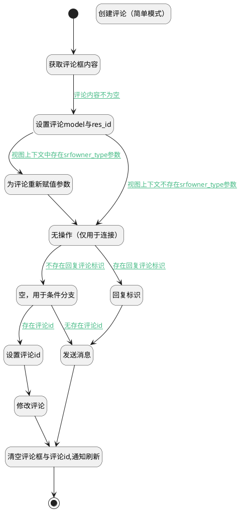

## 发送评论 <!-- {docsify-ignore-all} -->

   发送评论，并关闭评论输入框

### 处理过程




### 处理步骤说明

#### 开始 :id=Begin<sup class="footnote-symbol"> <font color=gray size=1>[开始]</font></sup>


#### 获取评论框内容 :id=RAWJSCODE1<sup class="footnote-symbol"> <font color=gray size=1>[直接前台代码]</font></sup>


<p class="panel-title"><b>执行代码</b></p>

```javascript
uiLogic.comment.body = uiLogic.view.layoutPanel.panelItems.message_inputbox.value;
```

#### 设置评论model与res_id :id=PREPAREJSPARAM1<sup class="footnote-symbol"> <font color=gray size=1>[准备参数]</font></sup>


1. 将`params(视图参数).mail_thread` 设置给  `comment(评论对象).res_id`
2. 将`params(视图参数).srfmodelname` 设置给  `comment(评论对象).model`
3. 将`view(当前视图对象).layoutPanel.panelItems.message_inputbox.editor` 设置给  `editor(编辑器)`
4. 将`comment` 设置给  `comment(评论对象).message_type`

#### 为评论重新赋值参数 :id=PREPAREJSPARAM6<sup class="footnote-symbol"> <font color=gray size=1>[准备参数]</font></sup>


1. 将`ctx(应用上下文变量).srfowner_type` 设置给  `comment(评论对象).owner_type`
2. 将`ctx(应用上下文变量).srfowner_type` 设置给  `comment(评论对象).model`

#### 无操作（仅用于连接） :id=PREPAREJSPARAM5<sup class="footnote-symbol"> <font color=gray size=1>[准备参数]</font></sup>


    无

#### 回复标识 :id=PREPAREJSPARAM2<sup class="footnote-symbol"> <font color=gray size=1>[准备参数]</font></sup>


1. 将`view(当前视图对象).reply_comment_id` 设置给  `comment(评论对象).parent_id`

#### 空，用于条件分支 :id=PREPAREJSPARAM4<sup class="footnote-symbol"> <font color=gray size=1>[准备参数]</font></sup>


    无

#### 设置评论id :id=PREPAREJSPARAM3<sup class="footnote-symbol"> <font color=gray size=1>[准备参数]</font></sup>


1. 将`view(当前视图对象).edit_comment_id` 设置给  `comment(评论对象).id`
2. 将`view(当前视图对象).edit_comment_id` 设置给  `ctx(应用上下文变量).mail_message`

#### 创建评论（简单模式） :id=DEACTION2<sup class="footnote-symbol"> <font color=gray size=1>[实体行为]</font></sup>


调用实体 [消息(MAIL_MESSAGE)](module/mail/mail_message.md) 行为 [Create](module/mail/mail_message#行为) ，行为参数为`comment(评论对象)`

#### 发送消息 :id=DEACTION_01<sup class="footnote-symbol"> <font color=gray size=1>[实体行为]</font></sup>


调用实体 [邮件会话(MAIL_THREAD)](module/mail/mail_thread.md) 行为 [消息发送代理(mail_message_post)](module/mail/mail_thread#行为) ，行为参数为`comment(评论对象)`

#### 修改评论 :id=DEACTION3<sup class="footnote-symbol"> <font color=gray size=1>[实体行为]</font></sup>


调用实体 [消息(MAIL_MESSAGE)](module/mail/mail_message.md) 行为 [Update](module/mail/mail_message#行为) ，行为参数为`comment(评论对象)`

#### 清空评论框与评论id,通知刷新 :id=RAWJSCODE2<sup class="footnote-symbol"> <font color=gray size=1>[直接前台代码]</font></sup>


<p class="panel-title"><b>执行代码</b></p>

```javascript
uiLogic.view.layoutPanel.panelItems.message_inputbox.value = '';
uiLogic.view.layoutPanel.panelItems.message_inputbox.data.message_inputbox = '';
uiLogic.view.edit_comment_id = null;
uiLogic.view.reply_comment_id = null;
uiLogic.editor.reply.value = null;
uiLogic.editor.toggleCollapse(false)
// 清空本地上传文件
uiLogic.editor.clearFiles();
//通知消息刷新
ibiz.mc.command.create.send({ srfdecodename: 'mail_message'})

```

#### 结束 :id=END1<sup class="footnote-symbol"> <font color=gray size=1>[结束]</font></sup>


### 连接条件说明
#### 评论内容不为空 :id=RAWJSCODE1-PREPAREJSPARAM1

```comment(评论对象).body``` ISNOTNULL
#### 视图上下文中存在srfowner_type参数 :id=PREPAREJSPARAM1-PREPAREJSPARAM6

```ctx(应用上下文变量).srfowner_type``` ISNOTNULL
#### 不存在回复评论标识 :id=PREPAREJSPARAM5-PREPAREJSPARAM4

```editor(编辑器).reply.value``` ISNULL
#### 无存在评论id :id=PREPAREJSPARAM4-DEACTION_01

```view(当前视图对象).edit_comment_id``` ISNULL
#### 存在评论id :id=PREPAREJSPARAM4-PREPAREJSPARAM3

```view(当前视图对象).edit_comment_id``` ISNOTNULL
#### 存在回复评论标识 :id=PREPAREJSPARAM5-PREPAREJSPARAM2

```editor(编辑器).reply.value``` ISNOTNULL
#### 视图上下文不存在srfowner_type参数 :id=PREPAREJSPARAM1-PREPAREJSPARAM5

```ctx(应用上下文变量).srfowner_type``` ISNULL


### 实体逻辑参数

|    中文名   |    代码名    |  数据类型      |备注 |
| --------| --------| --------  | --------   |
|应用上下文变量|ctx|导航视图参数绑定参数||
|视图参数|params|||
|传入变量(<i class="fa fa-check"/></i>)|Default|数据对象||
|评论对象|comment|数据对象||
|当前视图对象|view|当前视图对象||
|编辑器|editor|数据对象||
