## 刷新消息模板缓存 <!-- {docsify-ignore-all} -->

   

### 处理过程

```plantuml
@startuml
hide empty description
<style>
root {
  HyperlinkColor #42b983
}
</style>

hide empty description
state "开始" as Begin <<start>> [[$./refresh_cache#begin {"开始"}]]
state "执行脚本代码" as RAWSFCODE_01  [[$./refresh_cache#rawsfcode_01 {"执行脚本代码"}]]
state "结束" as END_01 <<end>> [[$./refresh_cache#end_01 {"结束"}]]


Begin --> RAWSFCODE_01
RAWSFCODE_01 --> END_01


@enduml
```




### 处理步骤说明

#### 执行脚本代码 :id=RAWSFCODE_01<sup class="footnote-symbol"> <font color=gray size=1>[直接后台代码]</font></sup>


<p class="panel-title"><b>执行代码[Groovy]</b></p>

```groovy
def defaultParam = logic.param("Default")
def templId = defaultParam.getReal()?.template_fs

// 通过系统运行时获取消息模板运行时对象
def templRuntime = sys.getSysMsgTemplRuntime(templId,true)

// 非空判断并执行重置操作
if(templRuntime != null) {
    templRuntime.reset()
}
```

#### 开始 :id=Begin<sup class="footnote-symbol"> <font color=gray size=1>[开始]</font></sup>


*- N/A*
#### 结束 :id=END_01<sup class="footnote-symbol"> <font color=gray size=1>[结束]</font></sup>


*- N/A*


### 实体逻辑参数

|    中文名   |    代码名    |  数据类型    |  实体   |备注 |
| --------| --------| -------- | -------- | --------   |
|传入变量(<i class="fa fa-check"/></i>)|Default|数据对象|[EMail模板(MAIL_TEMPLATE)](module/mail/mail_template.md)||
