## 计算附件数 <!-- {docsify-ignore-all} -->

   

### 处理过程

```plantuml
@startuml
hide empty description
<style>
root {
  HyperlinkColor #42b983
}
</style>

hide empty description
state "开始" as Begin <<start>> [[$./compute_attach_count#begin {"开始"}]]
state "绑定附件列表参数" as BINDPARAM_01  [[$./compute_attach_count#bindparam_01 {"绑定附件列表参数"}]]
state "获取附件数" as PREPAREPARAM_01  [[$./compute_attach_count#prepareparam_01 {"获取附件数"}]]
state "结束" as END_01 <<end>> [[$./compute_attach_count#end_01 {"结束"}]]
state "附件调试逻辑参数" as DEBUGPARAM_01  [[$./compute_attach_count#debugparam_01 {"附件调试逻辑参数"}]]


Begin --> DEBUGPARAM_01
DEBUGPARAM_01 --> BINDPARAM_01
BINDPARAM_01 --> PREPAREPARAM_01
PREPAREPARAM_01 --> END_01


@enduml
```

### 处理步骤说明

#### 绑定附件列表参数 :id=BINDPARAM_01 [绑定参数]

绑定参数`Default(传入变量)` 到 `attachments(附件列表)`
#### 获取附件数 :id=PREPAREPARAM_01 [准备参数]

1. 将`attachments(附件列表).size` 设置给  `Default(传入变量).MESSAGE_ATTACHMENT_COUNT(附件数量)`

#### 结束 :id=END_01 [结束]

返回 `Default(传入变量).MESSAGE_ATTACHMENT_COUNT`

#### 附件调试逻辑参数 :id=DEBUGPARAM_01 [调试逻辑参数]

> [!NOTE|label:调试信息|icon:fa fa-bug]
> 调试输出参数`Default(传入变量)`的详细信息

#### 开始 :id=Begin [开始]

*- N/A*

### 实体逻辑参数

|    中文名   |    代码名    |  数据类型    |  实体   |备注 |
| --------| --------| -------- | -------- | --------   |
|传入变量(<i class="fa fa-check"/></i>)|Default|数据对象|[邮件会话(MAIL_THREAD)](module/mail/mail_thread.md)||
|附件列表|attachments|数据对象列表|[附件(IR_ATTACHMENT)](module/base/ir_attachment.md)||
