## message_post_with_source <!-- {docsify-ignore-all} -->

   //TODO
待完善带模板转换消息发送逻辑，目前简单构造消息并新建

### 处理过程

```plantuml
@startuml
hide empty description
<style>
root {
  HyperlinkColor #42b983
}
</style>

hide empty description
state "开始" as Begin <<start>> [[$./message_post_with_source#begin {"开始"}]]
state "构造消息对象" as PREPAREPARAM_01  [[$./message_post_with_source#prepareparam_01 {"构造消息对象"}]]
state "建立消息" as DEACTION_01  [[$./message_post_with_source#deaction_01 {"建立消息"}]]
state "结束" as END_01 <<end>> [[$./message_post_with_source#end_01 {"结束"}]]


Begin --> PREPAREPARAM_01
PREPAREPARAM_01 --> DEACTION_01
DEACTION_01 --> END_01


@enduml
```

### 处理步骤说明

#### 开始 :id=Begin [开始]

*- N/A*
#### 构造消息对象 :id=PREPAREPARAM_01 [准备参数]

1. 将`Default(传入变量)` 拷贝到  `message`

#### 建立消息 :id=DEACTION_01 [实体行为]

调用实体 [消息(MAIL_MESSAGE)](module/mail/mail_message.md) 行为 [Create](module/mail/mail_message#行为) ，行为参数为`message`

将执行结果返回给参数`message`

#### 结束 :id=END_01 [结束]

返回 `message`

### 实体逻辑参数

|    中文名   |    代码名    |  数据类型    |  实体   |备注 |
| --------| --------| -------- | -------- | --------   |
|传入变量(<i class="fa fa-check"/></i>)|Default|数据对象|[邮件会话(MAIL_THREAD)](module/mail/mail_thread.md)||
|message|message|数据对象|[消息(MAIL_MESSAGE)](module/mail/mail_message.md)||
