## 填充资源工作时间数据 <!-- {docsify-ignore-all} -->

   

### 处理过程

```plantuml
@startuml
hide empty description
<style>
root {
  HyperlinkColor #42b983
}
</style>

hide empty description
state "开始" as Begin <<start>> [[$./fill_data#begin {"开始"}]]
state "执行脚本代码" as RAWSFCODE_01  [[$./fill_data#rawsfcode_01 {"执行脚本代码"}]]
state "结束" as END_01 <<end>> [[$./fill_data#end_01 {"结束"}]]


Begin --> RAWSFCODE_01
RAWSFCODE_01 --> END_01


@enduml
```




### 处理步骤说明

#### 开始 :id=Begin<sup class="footnote-symbol"> <font color=gray size=1>[开始]</font></sup>


*- N/A*
#### 执行脚本代码 :id=RAWSFCODE_01<sup class="footnote-symbol"> <font color=gray size=1>[直接后台代码]</font></sup>


<p class="panel-title"><b>执行代码[Groovy]</b></p>

```groovy
// 获取参数运行时对象
def  defaultParam = logic.param("Default")
// 获取参数实际值并打印
println("Default参数值：" + defaultParam.getReal())

```

#### 结束 :id=END_01<sup class="footnote-symbol"> <font color=gray size=1>[结束]</font></sup>


*- N/A*


### 实体逻辑参数

|    中文名   |    代码名    |  数据类型    |  实体   |备注 |
| --------| --------| -------- | -------- | --------   |
|传入变量(<i class="fa fa-check"/></i>)|Default|数据对象|[资源工作时间(RESOURCE_CALENDAR)](module/resource/resource_calendar.md)||
