## 新建逻辑 <!-- {docsify-ignore-all} -->

   

### 处理过程

```plantuml
@startuml
hide empty description
<style>
root {
  HyperlinkColor #42b983
}
</style>

hide empty description
state "开始" as Begin <<start>> [[$./prepare_create#begin {"开始"}]]
state "准备资源数据对象" as PREPAREPARAM_01  [[$./prepare_create#prepareparam_01 {"准备资源数据对象"}]]
state "建立资源" as DEACTION_01  [[$./prepare_create#deaction_01 {"建立资源"}]]
state "回填数据对象" as PREPAREPARAM_02  [[$./prepare_create#prepareparam_02 {"回填数据对象"}]]


Begin --> PREPAREPARAM_01
PREPAREPARAM_01 --> DEACTION_01
DEACTION_01 --> PREPAREPARAM_02


@enduml
```

### 处理步骤说明

#### 开始 :id=Begin [开始]

*- N/A*
#### 准备资源数据对象 :id=PREPAREPARAM_01 [准备参数]

1. 将`Default(传入变量).name(名称)` 设置给  `resource(资源).NAME(名称)`

#### 建立资源 :id=DEACTION_01 [实体行为]

调用实体 [资源(RESOURCE_RESOURCE)](module/resource/resource_resource.md) 行为 [Create](module/resource/resource_resource#行为) ，行为参数为`resource(资源)`

#### 回填数据对象 :id=PREPAREPARAM_02 [准备参数]

1. 将`resource(资源).ID(标识)` 设置给  `Default(传入变量).RESOURCE_ID(资源)`
2. 将`resource(资源).CALENDAR_ID(工时)` 设置给  `Default(传入变量).RESOURCE_CALENDAR_ID(工作时间)`

### 实体逻辑参数

|    中文名   |    代码名    |  数据类型    |  实体   |备注 |
| --------| --------| -------- | -------- | --------   |
|传入变量(<i class="fa fa-check"/></i>)|Default|数据对象|[资源装饰(RESOURCE_MIXIN)](module/resource/resource_mixin.md)||
|资源|resource|数据对象|[资源(RESOURCE_RESOURCE)](module/resource/resource_resource.md)||
