## 建立之前 <!-- {docsify-ignore-all} -->

   

### 处理过程

```plantuml
@startuml
hide empty description
<style>
root {
  HyperlinkColor #42b983
}
</style>

hide empty description
state "开始" as Begin <<start>> [[$./before_create#begin {"开始"}]]
state "准备参数" as PREPAREPARAM_01  [[$./before_create#prepareparam_01 {"准备参数"}]]
state "建立用户" as DEACTION_01  [[$./before_create#deaction_01 {"建立用户"}]]
state "回填user_id" as PREPAREPARAM_02  [[$./before_create#prepareparam_02 {"回填user_id"}]]


Begin --> PREPAREPARAM_01 : [[$./before_create#begin-prepareparam_01{判断类型} 判断类型]]


@enduml
```

### 处理步骤说明

#### 开始 :id=Begin [开始]

*- N/A*
#### 准备参数 :id=PREPAREPARAM_01 [准备参数]

1. 将`Default(传入变量).NAME(名称)` 设置给  `user.NAME(名称)`
2. 将`Default(传入变量).COMPANY_ID(公司)` 设置给  `user.COMPANY_ID(公司)`

#### 建立用户 :id=DEACTION_01 [实体行为]

调用实体 [用户(RES_USERS)](module/base/res_users.md) 行为 [Create](module/base/res_users#行为) ，行为参数为`user`

#### 回填user_id :id=PREPAREPARAM_02 [准备参数]

1. 将`user.ID(标识)` 设置给  `Default(传入变量).USER_ID(用户)`

### 连接条件说明
#### 判断类型 :id=Begin-PREPAREPARAM_01

`Default(传入变量).RESOURCE_TYPE(类型)` EQ `user` AND `Default(传入变量).USER_ID(用户)` ISNULL

### 实体逻辑参数

|    中文名   |    代码名    |  数据类型    |  实体   |备注 |
| --------| --------| -------- | -------- | --------   |
|传入变量(<i class="fa fa-check"/></i>)|Default|数据对象|[资源(RESOURCE_RESOURCE)](module/resource/resource_resource.md)||
|user|user|数据对象|[用户(RES_USERS)](module/base/res_users.md)||
