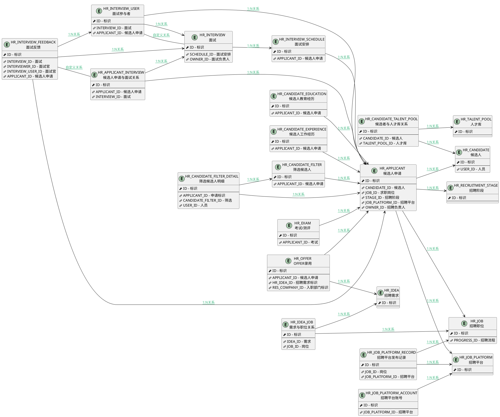

# 招聘 <!-- {docsify-ignore-all} -->

```plantuml
@startuml
skinparam svgLinkTarget _blank
<style>
root {
  HyperlinkColor #42b983
}
</style>
left to right direction

entity "HR_APPLICANT\n候选人申请" as HR_APPLICANT [[$../module/hr/hr_applicant {候选人申请}]] {
        <&key> ID - 标识
        --
        <&link-intact> CANDIDATE_ID - 候选人
        <&link-intact> JOB_ID - 求职岗位
        <&link-intact> STAGE_ID - 招聘阶段
        <&link-intact> JOB_PLATFORM_ID - 招聘平台
        <&link-intact> OWNER_ID - 招聘负责人
}
entity "HR_APPLICANT_INTERVIEW\n候选人申请与面试关系" as HR_APPLICANT_INTERVIEW [[$../module/hr/hr_applicant_interview {候选人申请与面试关系}]] {
        <&key> ID - 标识
        --
        <&link-intact> APPLICANT_ID - 候选人申请
        <&link-intact> INTERVIEW_ID - 面试
}
entity "HR_CANDIDATE\n候选人" as HR_CANDIDATE [[$../module/hr/hr_candidate {候选人}]] {
        <&key> ID - 标识
        --
        <&link-intact> USER_ID - 人员
}
entity "HR_CANDIDATE_EDUCATION\n候选人教育经历" as HR_CANDIDATE_EDUCATION [[$../module/hr/hr_candidate_education {候选人教育经历}]] {
        <&key> ID - 标识
        --
        <&link-intact> APPLICANT_ID - 候选人申请
}
entity "HR_CANDIDATE_EXPERIENCE\n候选人工作经历" as HR_CANDIDATE_EXPERIENCE [[$../module/hr/hr_candidate_experience {候选人工作经历}]] {
        <&key> ID - 标识
        --
        <&link-intact> APPLICANT_ID - 候选人申请
}
entity "HR_CANDIDATE_FILTER\n筛选候选人" as HR_CANDIDATE_FILTER [[$../module/hr/hr_candidate_filter {筛选候选人}]] {
        <&key> ID - 标识
        --
        <&link-intact> APPLICANT_ID - 候选人申请
}
entity "HR_CANDIDATE_FILTER_DETAIL\n筛选候选人明细" as HR_CANDIDATE_FILTER_DETAIL [[$../module/hr/hr_candidate_filter_detail {筛选候选人明细}]] {
        <&key> ID - 标识
        --
        <&link-intact> APPLICANT_ID - 申请标识
        <&link-intact> CANDIDATE_FILTER_ID - 筛选
        <&link-intact> USER_ID - 人员
}
entity "HR_CANDIDATE_TALENT_POOL\n候选者与人才库关系" as HR_CANDIDATE_TALENT_POOL [[$../module/hr/hr_candidate_talent_pool {候选者与人才库关系}]] {
        <&key> ID - 标识
        --
        <&link-intact> CANDIDATE_ID - 候选人
        <&link-intact> TALENT_POOL_ID - 人才库
}
entity "HR_EXAM\n考试/测评" as HR_EXAM [[$../module/hr/hr_exam {考试/测评}]] {
        <&key> ID - 标识
        --
        <&link-intact> APPLICANT_ID - 考试
}
entity "HR_IDEA\n招聘需求" as HR_IDEA [[$../module/hr/hr_idea {招聘需求}]] {
        <&key> ID - 标识
        --
}
entity "HR_IDEA_JOB\n需求与职位关系" as HR_IDEA_JOB [[$../module/hr/hr_idea_job {需求与职位关系}]] {
        <&key> ID - 标识
        --
        <&link-intact> IDEA_ID - 需求
        <&link-intact> JOB_ID - 岗位
}
entity "HR_INTERVIEW\n面试" as HR_INTERVIEW [[$../module/hr/hr_interview {面试}]] {
        <&key> ID - 标识
        --
        <&link-intact> SCHEDULE_ID - 面试安排
        <&link-intact> OWNER_ID - 面试负责人
}
entity "HR_INTERVIEW_FEEDBACK\n面试反馈" as HR_INTERVIEW_FEEDBACK [[$../module/hr/hr_interview_feedback {面试反馈}]] {
        <&key> ID - 标识
        --
        <&link-intact> INTERVIEW_ID - 面试
        <&link-intact> INTERVIEWER_ID - 面试官
        <&link-intact> INTERVIEW_USER_ID - 面试官
        <&link-intact> APPLICANT_ID - 候选人申请
}
entity "HR_INTERVIEW_SCHEDULE\n面试安排" as HR_INTERVIEW_SCHEDULE [[$../module/hr/hr_interview_schedule {面试安排}]] {
        <&key> ID - 标识
        --
        <&link-intact> APPLICANT_ID - 候选人申请
}
entity "HR_INTERVIEW_USER\n面试参与者" as HR_INTERVIEW_USER [[$../module/hr/hr_interview_user {面试参与者}]] {
        <&key> ID - 标识
        --
        <&link-intact> INTERVIEW_ID - 面试
        <&link-intact> APPLICANT_ID - 候选人申请
}
entity "HR_JOB\n招聘职位" as HR_JOB [[$../module/hr/hr_job {招聘职位}]] {
        <&key> ID - 标识
        --
        <&link-intact> PROGRESS_ID - 招聘流程
}
entity "HR_JOB_PLATFORM\n招聘平台" as HR_JOB_PLATFORM [[$../module/hr/hr_job_platform {招聘平台}]] {
        <&key> ID - 标识
        --
}
entity "HR_JOB_PLATFORM_ACCOUNT\n招聘平台账号" as HR_JOB_PLATFORM_ACCOUNT [[$../module/hr/hr_job_platform_account {招聘平台账号}]] {
        <&key> ID - 标识
        --
        <&link-intact> JOB_PLATFORM_ID - 招聘平台
}
entity "HR_JOB_PLATFORM_RECORD\n招聘平台发布记录" as HR_JOB_PLATFORM_RECORD [[$../module/hr/hr_job_platform_record {招聘平台发布记录}]] {
        <&key> ID - 标识
        --
        <&link-intact> JOB_ID - 岗位
        <&link-intact> JOB_PLATFORM_ID - 招聘平台
}
entity "HR_OFFER\nOFFER录用" as HR_OFFER [[$../module/hr/hr_offer {OFFER录用}]] {
        <&key> ID - 标识
        --
        <&link-intact> APPLICANT_ID - 候选人申请
        <&link-intact> HR_IDEA_ID - 招聘需求标识
        <&link-intact> RES_COMPANY_ID - 入职部门标识
}
entity "HR_RECRUITMENT_STAGE\n 招聘阶段" as HR_RECRUITMENT_STAGE [[$../module/hr/hr_recruitment_stage { 招聘阶段}]] {
        <&key> ID - 标识
        --
}
entity "HR_TALENT_POOL\n人才库" as HR_TALENT_POOL [[$../module/hr/hr_talent_pool {人才库}]] {
        <&key> ID - 标识
        --
}

HR_APPLICANT_INTERVIEW--> HR_APPLICANT : [[$../der/DER1N_HR_APPLICANT_INTERVIEW_HR_APPLICANT_APPLICANT_ID{DER1N_HR_APPLICANT_INTERVIEW_HR_APPLICANT_APPLICANT_ID} 1:N关系]]
HR_CANDIDATE_EDUCATION--> HR_APPLICANT : [[$../der/DER1N_HR_CANDIDATE_EDUCATION_HR_APPLICANT_APPLICANT_ID{DER1N_HR_CANDIDATE_EDUCATION_HR_APPLICANT_APPLICANT_ID} 1:N关系]]
HR_CANDIDATE_EXPERIENCE--> HR_APPLICANT : [[$../der/DER1N_HR_CANDIDATE_EXPERIENCE_HR_APPLICANT_APPLICANT_ID{DER1N_HR_CANDIDATE_EXPERIENCE_HR_APPLICANT_APPLICANT_ID} 1:N关系]]
HR_CANDIDATE_FILTER_DETAIL--> HR_APPLICANT : [[$../der/DER1N_HR_CANDIDATE_FILTER_DETAIL_HR_APPLICANT_APPLICANT_ID{DER1N_HR_CANDIDATE_FILTER_DETAIL_HR_APPLICANT_APPLICANT_ID} 1:N关系]]
HR_CANDIDATE_FILTER--> HR_APPLICANT : [[$../der/DER1N_HR_CANDIDATE_FILTER_HR_APPLICANT_APPLICANT_ID{DER1N_HR_CANDIDATE_FILTER_HR_APPLICANT_APPLICANT_ID} 1:N关系]]
HR_EXAM--> HR_APPLICANT : [[$../der/DER1N_HR_EXAM_HR_APPLICANT_APPLICANT_ID{DER1N_HR_EXAM_HR_APPLICANT_APPLICANT_ID} 1:N关系]]
HR_INTERVIEW_FEEDBACK--> HR_APPLICANT : [[$../der/DER1N_HR_INTERVIEW_FEEDBACK_HR_APPLICANT_APPLICANT_ID{DER1N_HR_INTERVIEW_FEEDBACK_HR_APPLICANT_APPLICANT_ID} 1:N关系]]
HR_INTERVIEW_SCHEDULE--> HR_APPLICANT : [[$../der/DER1N_HR_INTERVIEW_SCHEDULE_HR_APPLICANT_APPLICANT_ID{DER1N_HR_INTERVIEW_SCHEDULE_HR_APPLICANT_APPLICANT_ID} 1:N关系]]
HR_INTERVIEW_USER--> HR_APPLICANT : [[$../der/DER1N_HR_INTERVIEW_USER_HR_APPLICANT_APPLICANT_ID{DER1N_HR_INTERVIEW_USER_HR_APPLICANT_APPLICANT_ID} 1:N关系]]
HR_OFFER--> HR_APPLICANT : [[$../der/DER1N_HR_OFFER_HR_APPLICANT_APPLICANT_ID{DER1N_HR_OFFER_HR_APPLICANT_APPLICANT_ID} 1:N关系]]
HR_INTERVIEW_FEEDBACK-- HR_APPLICANT_INTERVIEW : [[$../der/HR_APPLICANT_INTERVIEW_INTERVIEW_FEEDBACK{HR_APPLICANT_INTERVIEW_INTERVIEW_FEEDBACK} 自定义关系]]
HR_APPLICANT--> HR_CANDIDATE : [[$../der/DER1N_HR_APPLICANT_HR_CANDIDATE_CANDIDATE_ID{DER1N_HR_APPLICANT_HR_CANDIDATE_CANDIDATE_ID} 1:N关系]]
HR_CANDIDATE_TALENT_POOL--> HR_CANDIDATE : [[$../der/DER1N_HR_CANDIDATE_TALENT_POOL_HR_CANDIDATE_CANDIDATE_ID{DER1N_HR_CANDIDATE_TALENT_POOL_HR_CANDIDATE_CANDIDATE_ID} 1:N关系]]
HR_CANDIDATE_FILTER_DETAIL--> HR_CANDIDATE_FILTER : [[$../der/DER1N_HR_CANDIDATE_FILTER_DETAIL_HR_CANDIDATE_FILTER_CANDIDATE_FILTER_ID{DER1N_HR_CANDIDATE_FILTER_DETAIL_HR_CANDIDATE_FILTER_CANDIDATE_FILTER_ID} 1:N关系]]
HR_IDEA_JOB--> HR_IDEA : [[$../der/DER1N_HR_IDEA_JOB_HR_IDEA_IDEA_ID{DER1N_HR_IDEA_JOB_HR_IDEA_IDEA_ID} 1:N关系]]
HR_OFFER--> HR_IDEA : [[$../der/DER1N_HR_OFFER_HR_IDEA_HR_IDEA_ID{DER1N_HR_OFFER_HR_IDEA_HR_IDEA_ID} 1:N关系]]
HR_APPLICANT_INTERVIEW--> HR_INTERVIEW : [[$../der/DER1N_HR_APPLICANT_INTERVIEW_HR_INTERVIEW_INTERVIEW_ID{DER1N_HR_APPLICANT_INTERVIEW_HR_INTERVIEW_INTERVIEW_ID} 1:N关系]]
HR_INTERVIEW_FEEDBACK--> HR_INTERVIEW : [[$../der/DER1N_HR_INTERVIEW_FEEDBACK_HR_INTERVIEW_INTERVIEW_ID{DER1N_HR_INTERVIEW_FEEDBACK_HR_INTERVIEW_INTERVIEW_ID} 1:N关系]]
HR_INTERVIEW_USER--> HR_INTERVIEW : [[$../der/DER1N_HR_INTERVIEW_USER_HR_INTERVIEW_INTERVIEW_ID{DER1N_HR_INTERVIEW_USER_HR_INTERVIEW_INTERVIEW_ID} 1:N关系]]
HR_INTERVIEW_USER-- HR_INTERVIEW : [[$../der/HR_INTERVIEW_HR_INTERVIEW_USER{HR_INTERVIEW_HR_INTERVIEW_USER} 自定义关系]]
HR_INTERVIEW--> HR_INTERVIEW_SCHEDULE : [[$../der/DER1N_HR_INTERVIEW_HR_INTERVIEW_SCHEDULE_SCHEDULE_ID{DER1N_HR_INTERVIEW_HR_INTERVIEW_SCHEDULE_SCHEDULE_ID} 1:N关系]]
HR_INTERVIEW_FEEDBACK--> HR_INTERVIEW_USER : [[$../der/DER1N_HR_INTERVIEW_FEEDBACK_HR_INTERVIEW_USER_INTERVIEW_USER_ID{DER1N_HR_INTERVIEW_FEEDBACK_HR_INTERVIEW_USER_INTERVIEW_USER_ID} 1:N关系]]
HR_APPLICANT--> HR_JOB : [[$../der/DER1N_HR_APPLICANT_HR_JOB_JOB_ID{DER1N_HR_APPLICANT_HR_JOB_JOB_ID} 1:N关系]]
HR_IDEA_JOB--> HR_JOB : [[$../der/DER1N_HR_IDEA_JOB_HR_JOB_JOB_ID{DER1N_HR_IDEA_JOB_HR_JOB_JOB_ID} 1:N关系]]
HR_JOB_PLATFORM_RECORD--> HR_JOB : [[$../der/DER1N_HR_JOB_PLATFORM_RECORD_HR_JOB_JOB_ID{DER1N_HR_JOB_PLATFORM_RECORD_HR_JOB_JOB_ID} 1:N关系]]
HR_APPLICANT--> HR_JOB_PLATFORM : [[$../der/DER1N_HR_APPLICANT_HR_JOB_PLATFORM_JOB_PLATFORM_ID{DER1N_HR_APPLICANT_HR_JOB_PLATFORM_JOB_PLATFORM_ID} 1:N关系]]
HR_JOB_PLATFORM_ACCOUNT--> HR_JOB_PLATFORM : [[$../der/DER1N_HR_JOB_PLATFORM_ACCOUNT_HR_JOB_PLATFORM_JOB_PLATFORM_ID{DER1N_HR_JOB_PLATFORM_ACCOUNT_HR_JOB_PLATFORM_JOB_PLATFORM_ID} 1:N关系]]
HR_JOB_PLATFORM_RECORD--> HR_JOB_PLATFORM : [[$../der/DER1N_HR_JOB_PLATFORM_RECORD_HR_JOB_PLATFORM_JOB_PLATFORM_ID{DER1N_HR_JOB_PLATFORM_RECORD_HR_JOB_PLATFORM_JOB_PLATFORM_ID} 1:N关系]]
HR_APPLICANT--> HR_RECRUITMENT_STAGE : [[$../der/DER1N_HR_APPLICANT_HR_RECRUITMENT_STAGE_STAGE_ID{DER1N_HR_APPLICANT_HR_RECRUITMENT_STAGE_STAGE_ID} 1:N关系]]
HR_CANDIDATE_TALENT_POOL--> HR_TALENT_POOL : [[$../der/DER1N_HR_CANDIDATE_TALENT_POOL_HR_TALENT_POOL_TALENT_POOL_ID{DER1N_HR_CANDIDATE_TALENT_POOL_HR_TALENT_POOL_TALENT_POOL_ID} 1:N关系]]


hide methods
@enduml
```
