## 获取工作台我的事项数 <!-- {docsify-ignore-all} -->

   

### 处理过程

```plantuml
@startuml
hide empty description
<style>
root {
  HyperlinkColor #42b983
}
</style>

hide empty description
state "开始" as Begin <<start>> [[$./get_my_summary_count#begin {"开始"}]]
state "准备参数" as PREPAREPARAM1  [[$./get_my_summary_count#prepareparam1 {"准备参数"}]]
state "调试逻辑参数" as DEBUGPARAM1  [[$./get_my_summary_count#debugparam1 {"调试逻辑参数"}]]
state "实体行为" as DEACTION1  [[$./get_my_summary_count#deaction1 {"实体行为"}]]
state "结束" as END1 <<end>> [[$./get_my_summary_count#end1 {"结束"}]]


Begin --> PREPAREPARAM1
PREPAREPARAM1 --> DEBUGPARAM1
DEBUGPARAM1 --> DEACTION1
DEACTION1 --> END1


@enduml
```

### 处理步骤说明

#### 开始 :id=Begin [开始]

*- N/A*
#### 准备参数 :id=PREPAREPARAM1 [准备参数]

1. 将`#` 设置给  `candidate.ID(标识)`

#### 调试逻辑参数 :id=DEBUGPARAM1 [调试逻辑参数]

> [!NOTE|label:调试信息|icon:fa fa-bug]
> 调试输出参数`candidate`的详细信息

#### 实体行为 :id=DEACTION1 [实体行为]

调用实体 [候选人(HR_CANDIDATE)](module/hr/hr_candidate.md) 行为 [获取工作台我的事项数(get_my_summary_count)](module/hr/hr_candidate#行为) ，行为参数为`candidate`

将执行结果返回给参数`candidate`

#### 结束 :id=END1 [结束]

返回 `candidate`

### 实体逻辑参数

|    中文名   |    代码名    |  数据类型    |  实体   |备注 |
| --------| --------| -------- | -------- | --------   |
|传入变量(<i class="fa fa-check"/></i>)|Default|数据对象|[工作台(WORKSPACE)](module/base/workspace.md)||
|candidate|candidate|数据对象|[候选人(HR_CANDIDATE)](module/hr/hr_candidate.md)||
