##  跳转应用详情页面 <!-- {docsify-ignore-all} -->

   

### 处理过程

```plantuml
@startuml
hide footbox
<style>
root {
  HyperlinkColor #42b983
}
</style>

hide empty description
state "开始" as Begin <<start>> [[$./open_app_info#begin {开始}]]
state "结束" as END1 <<end>> [[$./open_app_info#end1 {结束}]]
state "消息弹窗" as MSGBOX1  [[$./open_app_info#msgbox1 {消息弹窗}]]


Begin --> MSGBOX1
MSGBOX1 --> END1


@enduml
```

### 处理步骤说明

#### 开始 :id=Begin [开始]

#### 结束 :id=END1 [结束]

#### 消息弹窗 :id=MSGBOX1 [消息弹窗]

### 实体逻辑参数

|    中文名   |    代码名    |  数据类型      |备注 |
| --------| --------| --------  | --------   |
|传入变量(<i class="fa fa-check"/></i>)|Default|数据对象||
