## 附加候选人操作权限（临时） <!-- {docsify-ignore-all} -->

   

### 处理过程

```plantuml
@startuml
hide empty description
<style>
root {
  HyperlinkColor #42b983
}
</style>

hide empty description
state "开始" as Begin <<start>> [[$./add_candidate_oppriv#begin {"开始"}]]
state "准备参数" as PREPAREPARAM1  [[$./add_candidate_oppriv#prepareparam1 {"准备参数"}]]
state "准备参数" as PREPAREPARAM2  [[$./add_candidate_oppriv#prepareparam2 {"准备参数"}]]
state "结束" as END1 <<end>> [[$./add_candidate_oppriv#end1 {"结束"}]]


Begin --> PREPAREPARAM1 : [[$./add_candidate_oppriv#begin-prepareparam1{连接名称} 连接名称]]
PREPAREPARAM1 --> END1
Begin --> PREPAREPARAM2 : [[$./add_candidate_oppriv#begin-prepareparam2{连接名称} 连接名称]]
PREPAREPARAM2 --> END1


@enduml
```

### 处理步骤说明

#### 开始 :id=Begin [开始]

*- N/A*
#### 准备参数 :id=PREPAREPARAM1 [准备参数]

1. 将`STATE20` 设置给  `Default(传入变量).srfdataaccaction`

#### 准备参数 :id=PREPAREPARAM2 [准备参数]

1. 将`空值（NULL）` 设置给  `Default(传入变量).srfdataaccaction`

#### 结束 :id=END1 [结束]

*- N/A*

### 连接条件说明
#### 连接名称 :id=Begin-PREPAREPARAM1

`Default(传入变量).STAGE_SEQUENCE(招聘阶段序号)` EQ `20`
#### 连接名称 :id=Begin-PREPAREPARAM2

`Default(传入变量).STAGE_SEQUENCE(招聘阶段序号)` NOTEQ `20`

### 实体逻辑参数

|    中文名   |    代码名    |  数据类型    |  实体   |备注 |
| --------| --------| -------- | -------- | --------   |
|传入变量(<i class="fa fa-check"/></i>)|Default|数据对象|[候选人申请(HR_APPLICANT)](module/hr/hr_applicant.md)||
