## 候选人状态筛选 <!-- {docsify-ignore-all} -->

   

### 处理过程

```plantuml
@startuml
hide empty description
<style>
root {
  HyperlinkColor #42b983
}
</style>

hide empty description
state "开始" as Begin <<start>> [[$./get_applicant_state#begin {"开始"}]]
state "初筛" as RAWSQLCALL1  [[$./get_applicant_state#rawsqlcall1 {"初筛"}]]
state "人才推荐" as RAWSQLCALL2  [[$./get_applicant_state#rawsqlcall2 {"人才推荐"}]]
state "用人部门筛选" as RAWSQLCALL3  [[$./get_applicant_state#rawsqlcall3 {"用人部门筛选"}]]
state "初试" as RAWSQLCALL4  [[$./get_applicant_state#rawsqlcall4 {"初试"}]]
state "沟通offer" as RAWSQLCALL6  [[$./get_applicant_state#rawsqlcall6 {"沟通offer"}]]
state "大五性格测评" as RAWSQLCALL_02  [[$./get_applicant_state#rawsqlcall_02 {"大五性格测评"}]]
state "完成" as RAWSQLCALL_01  [[$./get_applicant_state#rawsqlcall_01 {"完成"}]]
state "复试" as RAWSQLCALL5  [[$./get_applicant_state#rawsqlcall5 {"复试"}]]
state "待入职" as RAWSQLCALL7  [[$./get_applicant_state#rawsqlcall7 {"待入职"}]]
state "结束" as END1 <<end>> [[$./get_applicant_state#end1 {"结束"}]]


Begin --> RAWSQLCALL1
RAWSQLCALL1 --> RAWSQLCALL2
RAWSQLCALL2 --> RAWSQLCALL3
RAWSQLCALL3 --> RAWSQLCALL4
RAWSQLCALL4 --> RAWSQLCALL5
RAWSQLCALL5 --> RAWSQLCALL6
RAWSQLCALL6 --> RAWSQLCALL_02
RAWSQLCALL_02 --> RAWSQLCALL7
RAWSQLCALL7 --> RAWSQLCALL_01
RAWSQLCALL_01 --> END1


@enduml
```




### 处理步骤说明

#### 初筛 :id=RAWSQLCALL1<sup class="footnote-symbol"> <font color=gray size=1>[直接SQL调用]</font></sup>


<p class="panel-title"><b>执行sql语句</b></p>

```sql
select count(1)  as status_20 
from hr_applicant ha 
left join hr_recruitment_stage hrs on ha.STAGE_ID  = hrs.id
where hrs.`SEQUENCE`  = 20 and ha.status = 1
```


重置参数`result(结果)`，并将执行sql结果赋值给参数`result(结果)`

#### 开始 :id=Begin<sup class="footnote-symbol"> <font color=gray size=1>[开始]</font></sup>


*- N/A*
#### 人才推荐 :id=RAWSQLCALL2<sup class="footnote-symbol"> <font color=gray size=1>[直接SQL调用]</font></sup>


<p class="panel-title"><b>执行sql语句</b></p>

```sql
select count(1)  as status_10 
from hr_applicant ha 
left join hr_recruitment_stage hrs on ha.STAGE_ID  = hrs.id
where hrs.`SEQUENCE`  = 10 and ha.status = 1
```


重置参数`result(结果)`，并将执行sql结果赋值给参数`result(结果)`

#### 用人部门筛选 :id=RAWSQLCALL3<sup class="footnote-symbol"> <font color=gray size=1>[直接SQL调用]</font></sup>


<p class="panel-title"><b>执行sql语句</b></p>

```sql
select count(1)  as status_30 
from hr_applicant ha 
left join hr_recruitment_stage hrs on ha.STAGE_ID  = hrs.id
where hrs.`SEQUENCE`  = 30 and ha.status = 1
```


重置参数`result(结果)`，并将执行sql结果赋值给参数`result(结果)`

#### 初试 :id=RAWSQLCALL4<sup class="footnote-symbol"> <font color=gray size=1>[直接SQL调用]</font></sup>


<p class="panel-title"><b>执行sql语句</b></p>

```sql
select count(1)  as status_40 
from hr_applicant ha 
left join hr_recruitment_stage hrs on ha.STAGE_ID  = hrs.id
where hrs.`SEQUENCE`  = 40 and ha.status = 1
```


重置参数`result(结果)`，并将执行sql结果赋值给参数`result(结果)`

#### 沟通offer :id=RAWSQLCALL6<sup class="footnote-symbol"> <font color=gray size=1>[直接SQL调用]</font></sup>


<p class="panel-title"><b>执行sql语句</b></p>

```sql
select count(1)  as status_70 
from hr_applicant ha 
left join hr_recruitment_stage hrs on ha.STAGE_ID  = hrs.id
where hrs.`SEQUENCE`  = 70 and ha.status = 1
```


重置参数`result(结果)`，并将执行sql结果赋值给参数`result(结果)`

#### 大五性格测评 :id=RAWSQLCALL_02<sup class="footnote-symbol"> <font color=gray size=1>[直接SQL调用]</font></sup>


<p class="panel-title"><b>执行sql语句</b></p>

```sql
select count(1)  as status_50 
from hr_applicant ha 
left join hr_recruitment_stage hrs on ha.STAGE_ID  = hrs.id
where hrs.`SEQUENCE`  = 50 and ha.status = 1
```


重置参数`result(结果)`，并将执行sql结果赋值给参数`result(结果)`

#### 完成 :id=RAWSQLCALL_01<sup class="footnote-symbol"> <font color=gray size=1>[直接SQL调用]</font></sup>


<p class="panel-title"><b>执行sql语句</b></p>

```sql
select count(1)  as status_90 
from hr_applicant ha 
left join hr_recruitment_stage hrs on ha.STAGE_ID  = hrs.id
where hrs.`SEQUENCE`  = 90 and ha.status = 1
```


重置参数`result(结果)`，并将执行sql结果赋值给参数`result(结果)`

#### 复试 :id=RAWSQLCALL5<sup class="footnote-symbol"> <font color=gray size=1>[直接SQL调用]</font></sup>


<p class="panel-title"><b>执行sql语句</b></p>

```sql
select count(1)  as status_60 
from hr_applicant ha 
left join hr_recruitment_stage hrs on ha.STAGE_ID  = hrs.id
where hrs.`SEQUENCE`  = 60 and ha.status = 1
```


重置参数`result(结果)`，并将执行sql结果赋值给参数`result(结果)`

#### 待入职 :id=RAWSQLCALL7<sup class="footnote-symbol"> <font color=gray size=1>[直接SQL调用]</font></sup>


<p class="panel-title"><b>执行sql语句</b></p>

```sql
select count(1)  as status_80 
from hr_applicant ha 
left join hr_recruitment_stage hrs on ha.STAGE_ID  = hrs.id
where hrs.`SEQUENCE`  = 80 and ha.status = 1
```


重置参数`result(结果)`，并将执行sql结果赋值给参数`result(结果)`

#### 结束 :id=END1<sup class="footnote-symbol"> <font color=gray size=1>[结束]</font></sup>


返回 `result(结果)`


### 实体逻辑参数

|    中文名   |    代码名    |  数据类型    |  实体   |备注 |
| --------| --------| -------- | -------- | --------   |
|传入变量(<i class="fa fa-check"/></i>)|Default|数据对象|[候选人申请(HR_APPLICANT)](module/hr/hr_applicant.md)||
|结果|result|数据对象|||
