## 获取工作台数据 <!-- {docsify-ignore-all} -->

   

### 处理过程

```plantuml
@startuml
hide empty description
<style>
root {
  HyperlinkColor #42b983
}
</style>

hide empty description
state "开始" as Begin <<start>> [[$./get_workspace_count#begin {"开始"}]]
state "今日初筛人数" as RAWSQLCALL1  [[$./get_workspace_count#rawsqlcall1 {"今日初筛人数"}]]
state "结束" as END1 <<end>> [[$./get_workspace_count#end1 {"结束"}]]
state "今日面试人数" as RAWSQLCALL2  [[$./get_workspace_count#rawsqlcall2 {"今日面试人数"}]]
state "待筛选简历" as RAWSQLCALL9  [[$./get_workspace_count#rawsqlcall9 {"待筛选简历"}]]
state "准备参数" as PREPAREPARAM1  [[$./get_workspace_count#prepareparam1 {"准备参数"}]]
state "待发送offer人数" as RAWSQLCALL3  [[$./get_workspace_count#rawsqlcall3 {"待发送offer人数"}]]
state "复试待反馈" as RAWSQLCALL8  [[$./get_workspace_count#rawsqlcall8 {"复试待反馈"}]]
state "待入职人数" as RAWSQLCALL4  [[$./get_workspace_count#rawsqlcall4 {"待入职人数"}]]
state "复试待面试" as RAWSQLCALL7  [[$./get_workspace_count#rawsqlcall7 {"复试待面试"}]]
state "初试待面试" as RAWSQLCALL5  [[$./get_workspace_count#rawsqlcall5 {"初试待面试"}]]
state "初试待反馈" as RAWSQLCALL6  [[$./get_workspace_count#rawsqlcall6 {"初试待反馈"}]]


Begin --> RAWSQLCALL1
RAWSQLCALL1 --> RAWSQLCALL2
RAWSQLCALL2 --> RAWSQLCALL9
RAWSQLCALL9 --> RAWSQLCALL3
RAWSQLCALL3 --> RAWSQLCALL4
RAWSQLCALL4 --> RAWSQLCALL5
RAWSQLCALL5 --> RAWSQLCALL6
RAWSQLCALL6 --> RAWSQLCALL7
RAWSQLCALL7 --> RAWSQLCALL8
RAWSQLCALL8 --> PREPAREPARAM1
PREPAREPARAM1 --> END1


@enduml
```




### 处理步骤说明

#### 开始 :id=Begin<sup class="footnote-symbol"> <font color=gray size=1>[开始]</font></sup>


*- N/A*
#### 今日初筛人数 :id=RAWSQLCALL1<sup class="footnote-symbol"> <font color=gray size=1>[直接SQL调用]</font></sup>


<p class="panel-title"><b>执行sql语句</b></p>

```sql
select count(1) today_to_filter_apply from hr_applicant ha where ha.STAGE_ID  = 10 and status = 1 and DATE(CREATE_DATE) = CURRENT_DATE;
```


重置参数`result(结果)`，并将执行sql结果赋值给参数`result(结果)`

#### 结束 :id=END1<sup class="footnote-symbol"> <font color=gray size=1>[结束]</font></sup>


返回 `result(结果)`

#### 今日面试人数 :id=RAWSQLCALL2<sup class="footnote-symbol"> <font color=gray size=1>[直接SQL调用]</font></sup>


<p class="panel-title"><b>执行sql语句</b></p>

```sql
select count(1) today_interview from hr_interview hi 
left join hr_interview_schedule his on hi.SCHEDULE_ID = his.id
where  DATE(his.START_DATE) = CURRENT_DATE;
```


重置参数`result(结果)`，并将执行sql结果赋值给参数`result(结果)`

#### 待筛选简历 :id=RAWSQLCALL9<sup class="footnote-symbol"> <font color=gray size=1>[直接SQL调用]</font></sup>


<p class="panel-title"><b>执行sql语句</b></p>

```sql
select count(1) filter_apply from hr_applicant ha where ha.STAGE_ID  = 10
```


重置参数`result(结果)`，并将执行sql结果赋值给参数`result(结果)`

#### 准备参数 :id=PREPAREPARAM1<sup class="footnote-symbol"> <font color=gray size=1>[准备参数]</font></sup>


1. 将`0` 设置给  `result(结果).to_assign_resume`

#### 待发送offer人数 :id=RAWSQLCALL3<sup class="footnote-symbol"> <font color=gray size=1>[直接SQL调用]</font></sup>


<p class="panel-title"><b>执行sql语句</b></p>

```sql
select count(1) to_send_offer from hr_applicant ha where (ha.STAGE_ID  = 40)
```


重置参数`result(结果)`，并将执行sql结果赋值给参数`result(结果)`

#### 复试待反馈 :id=RAWSQLCALL8<sup class="footnote-symbol"> <font color=gray size=1>[直接SQL调用]</font></sup>


<p class="panel-title"><b>执行sql语句</b></p>

```sql
SELECT COUNT(1)  AS second_feedback_pending 
FROM hr_interview_feedback hif 
left join hr_interview hi on hif.INTERVIEW_ID  = hi.id
where 
	hi.STAGE_ID  = 2
  and hif.RESULT_TYPE IS NOT NULL 
  AND hif.RESULT_TYPE != '';
```


重置参数`result(结果)`，并将执行sql结果赋值给参数`result(结果)`

#### 待入职人数 :id=RAWSQLCALL4<sup class="footnote-symbol"> <font color=gray size=1>[直接SQL调用]</font></sup>


<p class="panel-title"><b>执行sql语句</b></p>

```sql
select count(1) to_onboard from hr_applicant ha where (ha.STAGE_ID  = 50)
```


重置参数`result(结果)`，并将执行sql结果赋值给参数`result(结果)`

#### 复试待面试 :id=RAWSQLCALL7<sup class="footnote-symbol"> <font color=gray size=1>[直接SQL调用]</font></sup>


<p class="panel-title"><b>执行sql语句</b></p>

```sql
select count(1) second_interview_pending from hr_interview hi where hi.status != 1 and hi.STAGE_ID  = 2
```


重置参数`result(结果)`，并将执行sql结果赋值给参数`result(结果)`

#### 初试待面试 :id=RAWSQLCALL5<sup class="footnote-symbol"> <font color=gray size=1>[直接SQL调用]</font></sup>


<p class="panel-title"><b>执行sql语句</b></p>

```sql
select count(1) first_interview_pending from hr_interview hi where hi.status != 1 and hi.STAGE_ID  = 1
```


重置参数`result(结果)`，并将执行sql结果赋值给参数`result(结果)`

#### 初试待反馈 :id=RAWSQLCALL6<sup class="footnote-symbol"> <font color=gray size=1>[直接SQL调用]</font></sup>


<p class="panel-title"><b>执行sql语句</b></p>

```sql
SELECT COUNT(1)  AS first_feedback_pending 
FROM hr_interview_feedback hif 
left join hr_interview hi on hif.INTERVIEW_ID  = hi.id
where 
	hi.STAGE_ID  = 1
  and hif.RESULT_TYPE IS NOT NULL 
  AND hif.RESULT_TYPE != '';
```


重置参数`result(结果)`，并将执行sql结果赋值给参数`result(结果)`


### 实体逻辑参数

|    中文名   |    代码名    |  数据类型    |  实体   |备注 |
| --------| --------| -------- | -------- | --------   |
|传入变量(<i class="fa fa-check"/></i>)|Default|数据对象|[候选人申请(HR_APPLICANT)](module/hr/hr_applicant.md)||
|结果|result|数据对象|||
