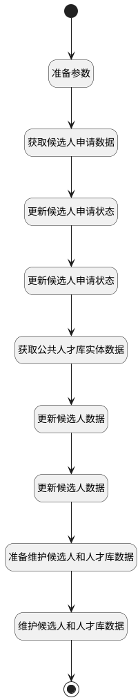

## 淘汰 <!-- {docsify-ignore-all} -->

   

### 处理过程




### 处理步骤说明

#### 开始 :id=Begin<sup class="footnote-symbol"> <font color=gray size=1>[开始]</font></sup>


*- N/A*
#### 准备参数 :id=PREPAREPARAM3<sup class="footnote-symbol"> <font color=gray size=1>[准备参数]</font></sup>


1. 将`Default(传入变量).ID(标识)` 设置给  `applicant(候选人申请).ID(标识)`

#### 获取候选人申请数据 :id=DEACTION3<sup class="footnote-symbol"> <font color=gray size=1>[实体行为]</font></sup>


调用实体 [候选人申请(HR_APPLICANT)](module/hr/hr_applicant.md) 行为 [Get](module/hr/hr_applicant#行为) ，行为参数为`applicant(候选人申请)`

将执行结果返回给参数`applicant(候选人申请)`

#### 更新候选人申请状态 :id=PREPAREPARAM4<sup class="footnote-symbol"> <font color=gray size=1>[准备参数]</font></sup>


1. 将`0` 设置给  `applicant(候选人申请).STATUS(申请状态)`

#### 更新候选人申请状态 :id=DEACTION4<sup class="footnote-symbol"> <font color=gray size=1>[实体行为]</font></sup>


调用实体 [候选人申请(HR_APPLICANT)](module/hr/hr_applicant.md) 行为 [Update](module/hr/hr_applicant#行为) ，行为参数为`applicant(候选人申请)`

#### 获取公共人才库实体数据 :id=RAWSQLCALL1<sup class="footnote-symbol"> <font color=gray size=1>[直接SQL调用]</font></sup>


<p class="panel-title"><b>执行sql语句</b></p>

```sql
select * from hr_talent_pool ht where name = '公共人才库'
```


重置参数`talentpool(人才库)`，并将执行sql结果赋值给参数`talentpool(人才库)`

#### 更新候选人数据 :id=PREPAREPARAM1<sup class="footnote-symbol"> <font color=gray size=1>[准备参数]</font></sup>


1. 将`Default(传入变量).CANDIDATE_ID(候选人)` 设置给  `candidate(候选人).ID(标识)`
2. 将`Default(传入变量).STAGE_NAME(阶段名)` 设置给  `candidate(候选人).LAST_TP_STAGE_NAME(归档前阶段)`
3. 将`applicant(候选人申请).LAST_EDU_SCHOOL(毕业院校)` 设置给  `candidate(候选人).LAST_EDU_SCHOOL(毕业院校)`
4. 将`applicant(候选人申请).LAST_EDU_DATE(毕业时间)` 设置给  `candidate(候选人).LAST_EDU_DATE(毕业时间)`
5. 将`applicant(候选人申请).LAST_EDU_SPECIALITY(所学专业)` 设置给  `candidate(候选人).LAST_EDU_SPECIALITY(所学专业)`
6. 将`applicant(候选人申请).LAST_EDU_ACADEMIC_DEGREE(最高学位)` 设置给  `candidate(候选人).LAST_EDU_ACADEMIC_DEGREE(最高学位)`
7. 将`applicant(候选人申请).LAST_EXP_COMPANY(最近工作公司)` 设置给  `candidate(候选人).LAST_EXP_COMPANY(最近工作公司)`
8. 将`applicant(候选人申请).LAST_EXP_JOB(最近工作岗位)` 设置给  `candidate(候选人).LAST_EXP_JOB(最近工作岗位)`
9. 将`applicant(候选人申请).LAST_EXP_DATE(最近工作时间)` 设置给  `candidate(候选人).LAST_EXP_DATE(最近工作时间)`
10. 将`applicant(候选人申请).TAGS(候选人标签)` 设置给  `candidate(候选人).LAST_TAGS(最新标签)`
11. 将`Default(传入变量).JOB_NAME(求职岗位名称)` 设置给  `candidate(候选人).LAST_TP_JOB_NAME(申请职位)`
12. 将`applicant(候选人申请).CREATE_DATE(建立时间)` 设置给  `candidate(候选人).LAST_TP_APPLIED_AT(申请日期)`
13. 将`淘汰` 设置给  `candidate(候选人).LAST_TP_ARCHIVE_REASON(归档原因)`
14. 将`talentpool(人才库).id(标识)` 设置给  `candidate(候选人).LAST_TP_TALENT_POOL(归档人才库)`
15. 将`计算式 null` 设置给  `candidate(候选人).LAST_TP_ARCHIVED_AT(归档日期)`
16. 将`applicant(候选人申请).STAGE_NAME(阶段名)` 设置给  `candidate(候选人).LAST_TP_STAGE_NAME(归档前阶段)`

#### 更新候选人数据 :id=DEACTION1<sup class="footnote-symbol"> <font color=gray size=1>[实体行为]</font></sup>


调用实体 [候选人(HR_CANDIDATE)](module/hr/hr_candidate.md) 行为 [Update](module/hr/hr_candidate#行为) ，行为参数为`candidate(候选人)`

#### 准备维护候选人和人才库数据 :id=PREPAREPARAM2<sup class="footnote-symbol"> <font color=gray size=1>[准备参数]</font></sup>


1. 将`candidate(候选人).ID(标识)` 设置给  `candidate_talentpool(候选人_人才库).CANDIDATE_ID(候选人)`
2. 将`公共人才库` 设置给  `candidate_talentpool(候选人_人才库).NAME(名称)`
3. 将`talentpool(人才库).ID(标识)` 设置给  `candidate_talentpool(候选人_人才库).TALENTPOOL_ID`

#### 维护候选人和人才库数据 :id=DEACTION2<sup class="footnote-symbol"> <font color=gray size=1>[实体行为]</font></sup>


调用实体 [候选者与人才库关系(HR_CANDIDATE_TALENT_POOL)](module/hr/hr_candidate_talent_pool.md) 行为 [Create](module/hr/hr_candidate_talent_pool#行为) ，行为参数为`candidate_talentpool(候选人_人才库)`

#### 结束 :id=END1<sup class="footnote-symbol"> <font color=gray size=1>[结束]</font></sup>


*- N/A*


### 实体逻辑参数

|    中文名   |    代码名    |  数据类型    |  实体   |备注 |
| --------| --------| -------- | -------- | --------   |
|传入变量(<i class="fa fa-check"/></i>)|Default|数据对象|[候选人申请(HR_APPLICANT)](module/hr/hr_applicant.md)||
|候选人申请|applicant|数据对象|[候选人申请(HR_APPLICANT)](module/hr/hr_applicant.md)||
|候选人|candidate|数据对象|[候选人(HR_CANDIDATE)](module/hr/hr_candidate.md)||
|候选人_人才库|candidate_talentpool|数据对象|[候选者与人才库关系(HR_CANDIDATE_TALENT_POOL)](module/hr/hr_candidate_talent_pool.md)||
|人才库|talentpool|数据对象|[人才库(HR_TALENT_POOL)](module/hr/hr_talent_pool.md)||
