## 推荐给用人部门 <!-- {docsify-ignore-all} -->

   

### 处理过程

```plantuml
@startuml
hide empty description
<style>
root {
  HyperlinkColor #42b983
}
</style>

hide empty description
state "开始" as Begin <<start>> [[$./recommend_department#begin {"开始"}]]
state "执行脚本代码" as RAWSFCODE1  [[$./recommend_department#rawsfcode1 {"执行脚本代码"}]]
state "结束" as END1 <<end>> [[$./recommend_department#end1 {"结束"}]]


Begin --> RAWSFCODE1
RAWSFCODE1 --> END1


@enduml
```




### 处理步骤说明

#### 开始 :id=Begin<sup class="footnote-symbol"> <font color=gray size=1>[开始]</font></sup>


*- N/A*
#### 执行脚本代码 :id=RAWSFCODE1<sup class="footnote-symbol"> <font color=gray size=1>[直接后台代码]</font></sup>


<p class="panel-title"><b>执行代码[Groovy]</b></p>

```groovy
// 获取默认参数
def _default = logic.param('Default').getReal()

// 直接获取srfactionparam为List<Map>，无需转换为IEntityDTO
List<Map> srfactionparam = _default.get('srfactionparam')
Map actionParam = srfactionparam.get(0) // 取第一个元素（Map类型）

// 从Map中直接获取reviewer_user_ids字段
String reviewerUserIds = actionParam.get('reviewer_user_ids')

// 解析JSON并提取id列表
def jsonSlurper = new groovy.json.JsonSlurper()
def list = jsonSlurper.parseText(reviewerUserIds)
def ids = list.collect { it.id } // 提取所有id

// 输出结果
println "提取的id列表："
ids.each { println it }

// 从Map中获取其他字段
String applicant_id = actionParam.get('applicant_id')
String type = actionParam.get('type')
String memo = actionParam.get('memo')

// 创建主表实体
def hrCandidateFilterRuntime = sys.dataentity('hr_candidate_filter')
def hrCandidateFilterEntity = hrCandidateFilterRuntime.createEntity()
hrCandidateFilterEntity.set("applicant_id", applicant_id)
hrCandidateFilterEntity.set("type", type)
hrCandidateFilterRuntime.create(hrCandidateFilterEntity)

// 创建明细表实体
def hrCandidateFilterDetailRuntime = sys.dataentity('hr_candidate_filter_detail')
String candidateFilterId = hrCandidateFilterEntity.get("id")

ids.each { id ->
    def hrCandidateFilterDetailEntity = hrCandidateFilterDetailRuntime.createEntity()
    hrCandidateFilterDetailEntity.set("candidate_filter_id", candidateFilterId)
    hrCandidateFilterDetailEntity.set("memo", memo)
    hrCandidateFilterDetailEntity.set("user_id", id)
    hrCandidateFilterDetailEntity.set("applicant_id", applicant_id)
    hrCandidateFilterDetailRuntime.save(hrCandidateFilterDetailEntity)
}

```

#### 结束 :id=END1<sup class="footnote-symbol"> <font color=gray size=1>[结束]</font></sup>


*- N/A*


### 实体逻辑参数

|    中文名   |    代码名    |  数据类型    |  实体   |备注 |
| --------| --------| -------- | -------- | --------   |
|传入变量(<i class="fa fa-check"/></i>)|Default|数据对象|[候选人申请(HR_APPLICANT)](module/hr/hr_applicant.md)||
