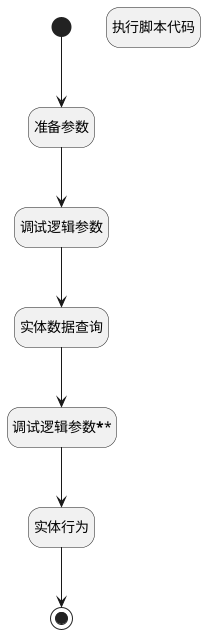

## 取消星标 <!-- {docsify-ignore-all} -->

   

### 处理过程




### 处理步骤说明

#### 开始 :id=Begin<sup class="footnote-symbol"> <font color=gray size=1>[开始]</font></sup>


*- N/A*
#### 准备参数 :id=PREPAREPARAM1<sup class="footnote-symbol"> <font color=gray size=1>[准备参数]</font></sup>


1. 将`用户全局对象.srfuserid` 设置给  `favorite_file(星标过滤).N_CREATE_MAN_EQ`
2. 将`Default(传入变量).id(标识)` 设置给  `favorite_file(星标过滤).N_OWNER_ID_EQ`
3. 将`hr_applicant` 设置给  `favorite_file(星标过滤).N_OWNER_TYPE_EQ`

#### 调试逻辑参数 :id=DEBUGPARAM2<sup class="footnote-symbol"> <font color=gray size=1>[调试逻辑参数]</font></sup>


> [!NOTE|label:调试信息|icon:fa fa-bug]
> 调试输出参数`favorite_file(星标过滤)`的详细信息


#### 结束 :id=END1<sup class="footnote-symbol"> <font color=gray size=1>[结束]</font></sup>


*- N/A*

#### 实体数据查询 :id=DEDATAQUERY1<sup class="footnote-symbol"> <font color=gray size=1>[实体数据查询]</font></sup>


调用实体 [收藏(FAVORITE)](module/base/favorite.md) 数据查询  ，查询参数为`favorite_file(星标过滤)`

将执行结果返回给参数`favorite_list(星标列表)`

#### 调试逻辑参数****** :id=DEBUGPARAM1<sup class="footnote-symbol"> <font color=gray size=1>[调试逻辑参数]</font></sup>


> [!NOTE|label:调试信息|icon:fa fa-bug]
> 调试输出参数`favorite_list(星标列表)`的详细信息


#### 实体行为 :id=DEACTION1<sup class="footnote-symbol"> <font color=gray size=1>[实体行为]</font></sup>


调用实体 [收藏(FAVORITE)](module/base/favorite.md) 行为 [Remove](module/base/favorite#行为) ，行为参数为`favorite_list(星标列表)`

#### 执行脚本代码 :id=RAWSFCODE1<sup class="footnote-symbol"> <font color=gray size=1>[直接后台代码]</font></sup>


<p class="panel-title"><b>执行代码[Groovy]</b></p>

```groovy
// 获取favorite数据实体
def favorite = sys.dataentity('FAVORITE');
// 获取默认参数
def defaultParam = logic.param('default').getReal();

// 从default参数中获取所需属性值
def id = defaultParam.get("id")
def srfuserId = defaultParam.get("srfuserid")
def hrApplicant = defaultParam.get("hr_applicant")

// 创建查询参数对象
def queryParam = new net.ibizsys.util.QueryParam();

// 添加多条件组合查询（同时满足三个条件）
queryParam.addFilter("OWNER_ID", "=", id);          // 匹配OWNER_ID
queryParam.addFilter("CREATE_MAN", "=", srfuserId); // 匹配创建人
queryParam.addFilter("OWNER_TYPE", "=", hrApplicant); // 匹配类型

// 执行查询获取符合条件的记录
def favoriteList = favorite.query(queryParam);

// 如果查询到记录，则删除
if(favoriteList != null && !favoriteList.isEmpty()) {
    // 获取第一条记录的ID（如果有多个符合条件的记录，可根据实际需求处理）
    def deleteId = favoriteList.get(0).get("id");
    // 执行删除操作
    favorite.delete(deleteId);
}

```


### 实体逻辑参数

|    中文名   |    代码名    |  数据类型    |  实体   |备注 |
| --------| --------| -------- | -------- | --------   |
|传入变量(<i class="fa fa-check"/></i>)|Default|数据对象|[候选人申请(HR_APPLICANT)](module/hr/hr_applicant.md)||
|星标|favorite|数据对象|[收藏(FAVORITE)](module/base/favorite.md)||
|星标过滤|favorite_file|过滤器|||
|星标列表|favorite_list|数据对象列表|[收藏(FAVORITE)](module/base/favorite.md)||
