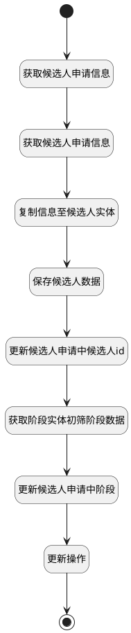

## 保存候选人申请信息 <!-- {docsify-ignore-all} -->

   

### 处理过程




### 处理步骤说明

#### 获取候选人申请信息 :id=PREPAREPARAM3<sup class="footnote-symbol"> <font color=gray size=1>[准备参数]</font></sup>


1. 将`Default(传入变量).ID(标识)` 设置给  `HR_APPLICANT(候选人申请实体).ID(标识)`

#### 获取候选人申请信息 :id=DEACTION3<sup class="footnote-symbol"> <font color=gray size=1>[实体行为]</font></sup>


调用实体 [候选人申请(HR_APPLICANT)](module/hr/hr_applicant.md) 行为 [Get](module/hr/hr_applicant#行为) ，行为参数为`HR_APPLICANT(候选人申请实体)`

将执行结果返回给参数`HR_APPLICANT(候选人申请实体)`

#### 复制信息至候选人实体 :id=PREPAREPARAM1<sup class="footnote-symbol"> <font color=gray size=1>[准备参数]</font></sup>


1. 将`HR_APPLICANT(候选人申请实体).CANDIDATE_DISPLAY_NAME(候选人姓名)` 设置给  `HR_CANDIDATE(候选人).NAME(候选人姓名)`
2. 将`HR_APPLICANT(候选人申请实体).JOB_NAME(求职岗位名称)` 设置给  `HR_CANDIDATE(候选人).LAST_TP_JOB_NAME(申请职位)`
3. 将`HR_APPLICANT(候选人申请实体).CREATE_DATE(建立时间)` 设置给  `HR_CANDIDATE(候选人).LAST_TP_APPLIED_AT(申请日期)`
4. 将`HR_APPLICANT(候选人申请实体).LAST_EXP_COMPANY(最近工作公司)` 设置给  `HR_CANDIDATE(候选人).LAST_EXP_COMPANY(最近工作公司)`
5. 将`HR_APPLICANT(候选人申请实体).LAST_EXP_JOB(最近工作岗位)` 设置给  `HR_CANDIDATE(候选人).LAST_EXP_JOB(最近工作岗位)`
6. 将`HR_APPLICANT(候选人申请实体).LAST_EXP_DATE(最近工作时间)` 设置给  `HR_CANDIDATE(候选人).LAST_EXP_DATE(最近工作时间)`
7. 将`HR_APPLICANT(候选人申请实体).LAST_EDU_SCHOOL(毕业院校)` 设置给  `HR_CANDIDATE(候选人).LAST_EDU_SCHOOL(毕业院校)`
8. 将`HR_APPLICANT(候选人申请实体).LAST_EDU_SPECIALITY(所学专业)` 设置给  `HR_CANDIDATE(候选人).LAST_EDU_SPECIALITY(所学专业)`
9. 将`HR_APPLICANT(候选人申请实体).LAST_EDU_DATE(毕业时间)` 设置给  `HR_CANDIDATE(候选人).LAST_EDU_DATE(毕业时间)`
10. 将`HR_APPLICANT(候选人申请实体).LAST_EDU_ACADEMIC_DEGREE(最高学位)` 设置给  `HR_CANDIDATE(候选人).LAST_EDU_ACADEMIC_DEGREE(最高学位)`
11. 将`HR_APPLICANT(候选人申请实体).GENDER(性别)` 设置给  `HR_CANDIDATE(候选人).GENDER(性别)`
12. 将`HR_APPLICANT(候选人申请实体).BIRTHDAY(出生日期)` 设置给  `HR_CANDIDATE(候选人).BIRTHDAY(出生日期)`
13. 将`HR_APPLICANT(候选人申请实体).EMAIL_FROM(候选人邮箱)` 设置给  `HR_CANDIDATE(候选人).EMAIL_FROM(邮箱)`
14. 将`HR_APPLICANT(候选人申请实体).MOBILE_PHONE(候选人手机号)` 设置给  `HR_CANDIDATE(候选人).PARTNER_PHONE`
15. 将`HR_APPLICANT(候选人申请实体).ADDRESS(候选人所在地)` 设置给  `HR_CANDIDATE(候选人).ADDRESS_ID(户籍地址)`
16. 将`HR_APPLICANT(候选人申请实体).EXPERIENCE(工作经验)` 设置给  `HR_CANDIDATE(候选人).EXPERIENCE(工作经验)`

#### 保存候选人数据 :id=DEACTION1<sup class="footnote-symbol"> <font color=gray size=1>[实体行为]</font></sup>


调用实体 [候选人(HR_CANDIDATE)](module/hr/hr_candidate.md) 行为 [Save](module/hr/hr_candidate#行为) ，行为参数为`HR_CANDIDATE(候选人)`

将执行结果返回给参数`HR_CANDIDATE(候选人)`

#### 开始 :id=Begin<sup class="footnote-symbol"> <font color=gray size=1>[开始]</font></sup>


*- N/A*
#### 更新候选人申请中候选人id :id=PREPAREPARAM2<sup class="footnote-symbol"> <font color=gray size=1>[准备参数]</font></sup>


1. 将`HR_CANDIDATE(候选人).ID(标识)` 设置给  `HR_APPLICANT(候选人申请实体).CANDIDATE_ID(候选人)`

#### 获取阶段实体初筛阶段数据 :id=RAWSQLCALL_01<sup class="footnote-symbol"> <font color=gray size=1>[直接SQL调用]</font></sup>


<p class="panel-title"><b>执行sql语句</b></p>

```sql
select * from hr_recruitment_stage hrs where hrs.NAME  = '初筛'
```


重置参数`stage(阶段)`，并将执行sql结果赋值给参数`stage(阶段)`

#### 更新候选人申请中阶段 :id=PREPAREPARAM_01<sup class="footnote-symbol"> <font color=gray size=1>[准备参数]</font></sup>


1. 将`stage(阶段).ID(标识)` 设置给  `HR_APPLICANT(候选人申请实体).STAGE_ID(招聘阶段)`

#### 更新操作 :id=DEACTION2<sup class="footnote-symbol"> <font color=gray size=1>[实体行为]</font></sup>


调用实体 [候选人申请(HR_APPLICANT)](module/hr/hr_applicant.md) 行为 [Update](module/hr/hr_applicant#行为) ，行为参数为`HR_APPLICANT(候选人申请实体)`

#### 结束 :id=END1<sup class="footnote-symbol"> <font color=gray size=1>[结束]</font></sup>


*- N/A*


### 实体逻辑参数

|    中文名   |    代码名    |  数据类型    |  实体   |备注 |
| --------| --------| -------- | -------- | --------   |
|传入变量(<i class="fa fa-check"/></i>)|Default|数据对象|[候选人申请(HR_APPLICANT)](module/hr/hr_applicant.md)||
|候选人申请实体|HR_APPLICANT|数据对象|[候选人申请(HR_APPLICANT)](module/hr/hr_applicant.md)||
|候选人|HR_CANDIDATE|数据对象|[候选人(HR_CANDIDATE)](module/hr/hr_candidate.md)||
|阶段|stage|数据对象|[ 招聘阶段(HR_RECRUITMENT_STAGE)](module/hr/hr_recruitment_stage.md)||
