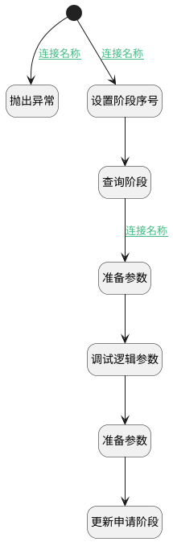

## 修改申请阶段 <!-- {docsify-ignore-all} -->

   

### 处理过程

### 处理步骤说明

#### 抛出异常 :id=THROWEXCEPTION1 [抛出异常]

> [!ATTENTION|label:抛出异常|icon:fa fa-warning]
> 错误信息：未传入阶段序号

#### 开始 :id=Begin [开始]

*- N/A*
#### 设置阶段序号 :id=PREPAREPARAM1 [准备参数]

1. 将`Default(传入变量).STAGE_SEQUENCE(招聘阶段序号)` 设置给  `stage_filter.n_sequence_eq`

#### 查询阶段 :id=DEDATASET1 [实体数据集]

调用实体 [ 招聘阶段(HR_RECRUITMENT_STAGE)](module/hr/hr_recruitment_stage.md) 数据集合 [数据集(DEFAULT)](module/hr/hr_recruitment_stage#数据集合) ，查询参数为`stage_filter`

将执行结果返回给参数`page_stage`

#### 准备参数 :id=PREPAREPARAM2 [准备参数]

1. 将`page_stage.0` 绑定给  `hr_stage`

#### 调试逻辑参数 :id=DEBUGPARAM1 [调试逻辑参数]

> [!NOTE|label:调试信息|icon:fa fa-bug]
> 调试输出参数`hr_stage`的详细信息

#### 准备参数 :id=PREPAREPARAM3 [准备参数]

1. 将`hr_stage.ID(标识)` 设置给  `hr_applicant.STAGE_ID(招聘阶段)`
2. 将`Default(传入变量).ID(标识)` 设置给  `hr_applicant.ID(标识)`

#### 更新申请阶段 :id=DEACTION1 [实体行为]

调用实体 [候选人申请(HR_APPLICANT)](module/hr/hr_applicant.md) 行为 [Update](module/hr/hr_applicant#行为) ，行为参数为`hr_applicant`

### 连接条件说明
#### 连接名称 :id=Begin-PREPAREPARAM1

`Default(传入变量).STAGE_SEQUENCE(招聘阶段序号)` ISNOTNULL
#### 连接名称 :id=DEDATASET1-PREPAREPARAM2

`page_stage(page_stage).size` GT `0`
#### 连接名称 :id=Begin-THROWEXCEPTION1

`Default(传入变量).STAGE_SEQUENCE(招聘阶段序号)` ISNULL

### 实体逻辑参数

|    中文名   |    代码名    |  数据类型    |  实体   |备注 |
| --------| --------| -------- | -------- | --------   |
|传入变量(<i class="fa fa-check"/></i>)|Default|数据对象|[候选人申请(HR_APPLICANT)](module/hr/hr_applicant.md)||
|hr_applicant|hr_applicant|数据对象|[候选人申请(HR_APPLICANT)](module/hr/hr_applicant.md)||
|hr_stage|hr_stage|数据对象|[ 招聘阶段(HR_RECRUITMENT_STAGE)](module/hr/hr_recruitment_stage.md)||
|page_stage|page_stage|分页查询|||
|stage_filter|stage_filter|过滤器|||
