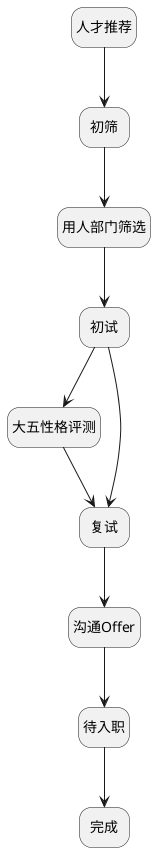

## 常规流程 <!-- {docsify-ignore-all} -->

   

### 主状态迁移

### 主状态说明

#### 人才推荐 :id=MAINSTATE [10]

###### 拒绝行为

###### 拒绝操作标识

###### 拒绝属性

#### 初筛 :id=MAINSTATE1 [20]

###### 拒绝行为

###### 允许操作标识
* `UPDATE`
* `DELETE`
* `CANDIDATE_FILTER`

###### 拒绝属性

#### 大五性格评测 :id=MAINSTATE7 [50]

###### 拒绝行为

###### 允许操作标识
* `UPDATE`
* `DELETE`
* `SECOND_INTERVIEW`

###### 允许属性

#### 复试 :id=MAINSTATE8 [60]

###### 拒绝行为

###### 允许操作标识
* `UPDATE`
* `DELETE`
* `OFFER`

###### 允许属性

#### 完成 :id=MAINSTATE9 [90]

###### 拒绝行为

###### 拒绝操作标识

###### 允许属性

#### 用人部门筛选 :id=MAINSTATE2 [30]

###### 拒绝行为

###### 允许操作标识
* `UPDATE`
* `DELETE`
* `FIRST_INTERVIEW`

###### 允许属性

#### 初试 :id=MAINSTATE3 [40]

###### 拒绝行为

###### 允许操作标识
* `UPDATE`
* `DELETE`
* `EXAM`

###### 允许属性

#### 沟通Offer :id=MAINSTATE4 [70]

###### 拒绝行为

###### 允许操作标识
* `UPDATE`
* `DELETE`
* `PENDING_ONBOARDING`

###### 允许属性

#### 待入职 :id=MAINSTATE5 [80]

###### 拒绝行为

###### 允许操作标识
* `UPDATE`
* `DELETE`
* `ONBOARDED`

###### 允许属性

