## 设置激活tab <!-- {docsify-ignore-all} -->

   

### 处理过程

```plantuml
@startuml
hide footbox
<style>
root {
  HyperlinkColor #42b983
}
</style>

hide empty description
state "开始" as Begin <<start>> [[$./active_tab#begin {开始}]]
state "注入脚本代码" as RAWJSCODE_01  [[$./active_tab#rawjscode_01 {注入脚本代码}]]


Begin --> RAWJSCODE_01


@enduml
```




### 处理步骤说明

#### 开始 :id=Begin<sup class="footnote-symbol"> <font color=gray size=1>[开始]</font></sup>


#### 注入脚本代码 :id=RAWJSCODE_01<sup class="footnote-symbol"> <font color=gray size=1>[直接前台代码]</font></sup>


<p class="panel-title"><b>执行代码</b></p>

```javascript
const active_tab = uiLogic.default.srfactivetab;
if(active_tab){
    view.layoutPanel.panelItems.form.control.details.tabpanel1.state.activeTab = 'tabpanel1_'+active_tab;
}

```


### 实体逻辑参数

|    中文名   |    代码名    |  数据类型      |备注 |
| --------| --------| --------  | --------   |
|传入变量(<i class="fa fa-check"/></i>)|Default|数据对象||
