## 获取filter数据 <!-- {docsify-ignore-all} -->

   

### 处理过程

```plantuml
@startuml
hide footbox
<style>
root {
  HyperlinkColor #42b983
}
</style>

hide empty description
state "开始" as Begin <<start>> [[$./filter_info#begin {开始}]]
state "结束" as END1 <<end>> [[$./filter_info#end1 {结束}]]
state "打开编辑界面" as DEUIACTION1  [[$./filter_info#deuiaction1 {打开编辑界面}]]
state "准备参数" as PREPAREJSPARAM1  [[$./filter_info#preparejsparam1 {准备参数}]]
state "注入脚本代码" as RAWJSCODE1  [[$./filter_info#rawjscode1 {注入脚本代码}]]
state "实体行为" as DEACTION1  [[$./filter_info#deaction1 {实体行为}]]


Begin --> DEACTION1
DEACTION1 --> RAWJSCODE1
RAWJSCODE1 --> PREPAREJSPARAM1
PREPAREJSPARAM1 --> DEUIACTION1
DEUIACTION1 --> END1


@enduml
```




### 处理步骤说明

#### 开始 :id=Begin<sup class="footnote-symbol"> <font color=gray size=1>[开始]</font></sup>


#### 实体行为 :id=DEACTION1<sup class="footnote-symbol"> <font color=gray size=1>[实体行为]</font></sup>


调用实体 [筛选候选人(HR_CANDIDATE_FILTER)](module/hr/hr_candidate_filter.md) 行为 [获取信息(get_info)](module/hr/hr_candidate_filter#行为) ，行为参数为`Default(传入变量)`

将执行结果返回给参数`Default(传入变量)`

#### 注入脚本代码 :id=RAWJSCODE1<sup class="footnote-symbol"> <font color=gray size=1>[直接前台代码]</font></sup>


<p class="panel-title"><b>执行代码</b></p>

```javascript
console.log(uiLogic.default)
```

#### 准备参数 :id=PREPAREJSPARAM1<sup class="footnote-symbol"> <font color=gray size=1>[准备参数]</font></sup>


1. 将`Default(传入变量).id` 设置给  `ctx(应用上下文变量).hr_candidate_filter`

#### 打开编辑界面 :id=DEUIACTION1<sup class="footnote-symbol"> <font color=gray size=1>[实体界面行为调用]</font></sup>


调用实体 [筛选候选人(HR_CANDIDATE_FILTER)](module/hr/hr_candidate_filter.md) 界面行为 [打开推荐界面](module/hr/hr_candidate_filter#界面行为) ，行为参数为`Default(传入变量)`

#### 结束 :id=END1<sup class="footnote-symbol"> <font color=gray size=1>[结束]</font></sup>


### 实体逻辑参数

|    中文名   |    代码名    |  数据类型      |备注 |
| --------| --------| --------  | --------   |
|传入变量(<i class="fa fa-check"/></i>)|Default|数据对象||
|应用上下文变量|ctx|导航视图参数绑定参数||
