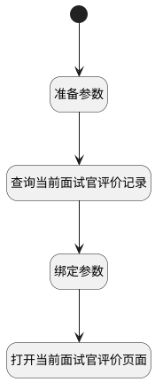

## 填写反馈 <!-- {docsify-ignore-all} -->

   

### 处理过程

### 处理步骤说明

#### 开始 :id=Begin [开始]

#### 准备参数 :id=PREPAREJSPARAM1 [准备参数]

1. 将`Default(传入变量).applicant_id` 设置给  `feedback_filter.n_applicant_id_eq`
2. 将`Default(传入变量).interview_id` 设置给  `feedback_filter.n_interview_id_eq`

#### 查询当前面试官评价记录 :id=DEDATASET1 [实体数据集]

#### 绑定参数 :id=BINDPARAM1 [绑定参数]

绑定参数`page_feedback` 到 `feedback`
#### 打开当前面试官评价页面 :id=DEUIACTION1 [实体界面行为调用]

调用实体 [面试反馈(HR_INTERVIEW_FEEDBACK)](module/hr/hr_interview_feedback.md) 界面行为 [填写面试反馈（用人经理端）](module/hr/hr_interview_feedback#界面行为) ，行为参数为`feedback`

### 实体逻辑参数

|    中文名   |    代码名    |  数据类型      |备注 |
| --------| --------| --------  | --------   |
|传入变量(<i class="fa fa-check"/></i>)|Default|数据对象||
|feedback|feedback|数据对象||
|page_feedback|page_feedback|分页查询||
|feedback_filter|feedback_filter|过滤器||
